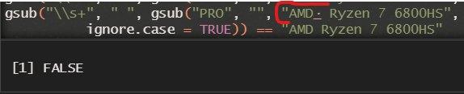
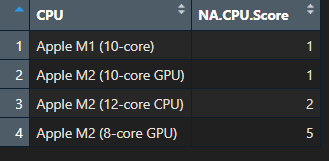
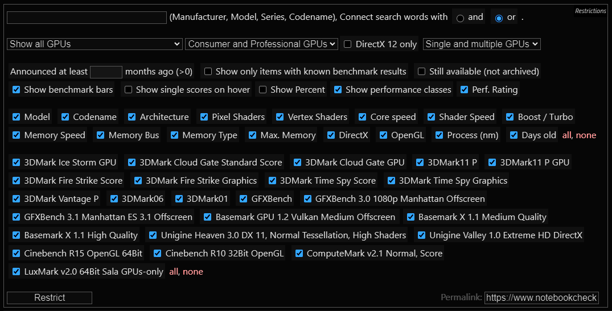

### Setting

`Function` biar gak perlu ganti `backslash` (`\`) jadi `slash` (`/`).

```{r}
path <- function() gsub  ( "\\\\",  "/",  readClipboard ()  )
#Copy path, Panggil function di console
#Copy r path, paste ke var yang diinginkan
```

Set Working Directory

```{r setup, include=FALSE, echo=FALSE}
require("knitr")
opts_knit$set(root.dir = "C:/Users/Fathan/Documents/Obsidian Vault/2. Kuliah/Smt 5/8. Pengantar Sains Data/Proj")
```

`Function` biar gak perlu repot buat `install("")` atau `load()` *package.*

```{r}
#                      -=( Install & Load Package Function )=-
install_load <- function (package1, ...)  {   

   # convert arguments to vector
   packages <- c(package1, ...)

   # start loop to determine if each package is installed
   for(package in packages){

       # if package is installed locally, load
       if(package %in% rownames(installed.packages()))
          do.call('library', list(package))

       # if package is not installed locally, download, then load
       else {
          install.packages(package)
          do.call("library", list(package))
       }
   } 
}
```

`Function` `position_stack_and_nudge`

```{r}
#                          -=( GGPLOT POSITION FUNCTION )=-
library(ggplot2)
position_stack_and_nudge <- function(x = 0, y = 0, vjust = 1, reverse = FALSE) {
  ggproto(NULL, PositionStackAndNudge,
    x = x,
    y = y,
    vjust = vjust,
    reverse = reverse
  )
}

#' @rdname ggplot2-ggproto
#' @format NULL
#' @usage NULL
#' @noRd
PositionStackAndNudge <- ggproto("PositionStackAndNudge", PositionStack,
  x = 0,
  y = 0,

  setup_params = function(self, data) {
    c(
        list(x = self$x, y = self$y),
        ggproto_parent(PositionStack, self)$setup_params(data)
    )
  },

  compute_layer = function(self, data, params, panel) {
    # operate on the stacked positions (updated in August 2020)
    data = ggproto_parent(PositionStack, self)$compute_layer(data, params, panel)

    x_orig <- data$x
    y_orig <- data$y
    # transform only the dimensions for which non-zero nudging is requested
    if (any(params$x != 0)) {
      if (any(params$y != 0)) {
        data <- transform_position(data, function(x) x + params$x, function(y) y + params$y)
      } else {
        data <- transform_position(data, function(x) x + params$x, NULL)
      }
    } else if (any(params$y != 0)) {
      data <- transform_position(data, function(x) x, function(y) y + params$y)
    }
    data$nudge_x <- data$x
    data$nudge_y <- data$y
    data$x <- x_orig
    data$y <- y_orig

    data
  },

  compute_panel = function(self, data, params, scales) {
      ggproto_parent(PositionStack, self)$compute_panel(data, params, scales)
  }
)
```

*Theme* *Pie Chart.*

```{r}
install_load('ggrepel')
#                             -=( Label Pie Chart )=-
lab.p <- list(
  geom_label_repel( aes(label = paste0(perc,"(",n,")")),
          position = position_stack_and_nudge(vjust = 0.5, x = 0.65),
          direction='y', fontface = 'bold', color = 'white',
          box.padding = unit(0.35, "lines"),
          point.padding = unit(0.5, "lines"), segment.color = '#454545',
          size=10) 
)
#                           -=( THEME Pie Chart )=-
theme.p <- list(
  theme_void()  , 
        theme(
        text = element_text(size = 36),
        axis.text.y = element_text(vjust = .5, face = "bold"),
        plot.title = element_text(hjust = 0.5),
        plot.subtitle = element_text(hjust = 0.5) )
)
```

`Function` *Pie Chart*

```{r}
#                           -=( Pie Chart FUNCTION )=-
plot.p <- function(dt, title = "Pice Chart"){
  install_load("ggplot2", "dplyr", "viridis", "ggrepel", "tidyverse",'scales')
  #DATA FRAME
  df <- data.frame(ket = dt) %>%
    #Frequency
    group_by(ket) %>%
    count() %>%
    ungroup() %>%
    mutate(perc = percent(n/sum(n), accuracy = 0.1, trim = FALSE))
  
  #PIE CHART
  sp <- ggplot(data=df, aes(x = "", y = n, fill = ket)) +
          geom_col(width = 1, color = "white", linewidth = 2,
                   position = position_stack()) +
        coord_polar(theta = "y") +
        scale_alpha_manual(values = c("0"=0, "1"=1, "2"=0.7), guide=F) +
        scale_x_discrete(breaks = NULL) +
        scale_y_continuous(breaks = NULL) +
        labs(title = title) + #Title
        #COLORING
        scale_fill_viridis(alpha = 0.75, #Opacity
                           begin = 0.2, #Color pallte scale begins
                           end = 0.5, #Color pallte scale ends
                           direction = -1, #Flip color scale
                           discrete = T, #Discrete Value
                           option = "D") + #Color Palette
        theme.p + #Theme
        xlab("") + ylab("") + lab.p #Labels
return(sp)
}
```

# Tentang Data

{width="521"}

Data kelompok kami merupakan data hasil *web scraping* dari [laptopmedia.com](https://laptopmedia.com/specs/?size=n_100_n) dengan menggunakan *extension* *`web scraper`* dari chrome. Data ini memiliki 7 peubah yakni : `Name` (Nama laptop), `Price` (Harga), `CPU`, `GPU`, `RAM`, `Display` (layar), dan `Storage`.

Data tersebut perlu dibersihkan dan dimanage sehingga dapat di olah pada analisis selanjutnya.

### Data input

```{r}
install_load('readxl','dplyr','kableExtra')
data <- read_xlsx("data.xlsx", sheet="Laptop")
data <- data[,-c(1,2)]
cat("Jumlah Kolom:", ncol(data), "\n")
cat("Jumlah Baris:", nrow(data), "\n")

kable(head(data)) %>% kable_styling(bootstrap_options = "striped", full_width = FALSE)
```

### Cek Missing Data

Penting untuk melihat ada tidaknya missing data.

```{r}
# Mencari indeks baris dan kolom yang mengandung NA
na.idx <- which(is.na(data), arr.ind = TRUE)
cat("Banyaknya data NA : ", nrow(na.idx))

# Menampilkan data raw dengan baris dan kolom yang mengandung NA
install_load('kableExtra','dplyr','DT')

#Menampilkan tabel
kable(data[                        # Subsetting
                unique(na.idx[, 1]),   # Vektor indeks baris yang mengandung NA
                unique(na.idx[, 2])  ] # Vektor indeks kolom yang mengandung NA
      # Style Tabel
      ) %>% kable_styling(bootstrap_options = "striped", full_width = FALSE)
```

### Hapus Data NA

Karena peubah diatas sulit untuk diduga maka kami putuskan untuk menghapus data `NA` tersebut.

```{r}
data <- data[ -unique(na.idx[, 1]),  ]
cat("Jumlah Baris:", nrow(data), "\n")
```

# 1. Brand Classification

{width="556"}

Klasifikasi brand ini diperlukan agar kita dapat melihat lebih jelas sebaran brand yang dijual pada *e-commerce* ini maupun untuk analisis selanjutnya.

```{r}
# Install dan muat paket stringr jika belum diinstal
install_load('stringr')

# Daftar kata kunci merek
brands <- c(
    "HP", "Hewlett-Packard", "Acer", "Dell", "Lenovo", "ASUS",
    "MSI", "Alienware", "Apple", "LG", "Samsung", "Aorus", "Gigabyte",
    "Razer", "Microsoft", "Panasonic", "Chuwi", "Toshiba", "Fusion5")

# Fungsi untuk menetapkan merek berdasarkan kata kunci
assign_brand <- function(data) {
  for (brand_keywords in brands) {
    if (any(str_detect(tolower(data), tolower(brand_keywords)))) {
      return(brand_keywords[1])  # Ambil merek pertama yang cocok
    }
  }
  return("Tidak Diketahui")
}

# Menambahkan kolom brand berdasarkan fungsi
data$Brand <- sapply(data$Name, assign_brand)

# Tampilkan hasil
kable(head(data)) %>% kable_styling(bootstrap_options = "striped", full_width = FALSE)
```

### a. Sebaran Brand Laptop

```{r dpi=300, fig1, fig.height = 12, fig.width = 20, fig.align = "center"}
# Membuat bar chart persentase
ggplot(data = data %>% count(Brand) %>% # banyaknya laptop brand x
  mutate(perc = round(n / sum(n) * 100)), #buat persentase
       aes(x = reorder(Brand, -n), y = perc)) +
  geom_bar(stat = "identity", fill='#2D99AE') +
  geom_text(aes(label = prettyNum(n,big.mark = ",")
                ), vjust = -0.5, size = 7, col="orange4", 
            fontface = "bold") + # Tambahkan label
  labs(x = "Brand", y = "Persentase (%)", 
       title = "Sebaran Brand Laptop") +
  theme(axis.text.x = element_text(angle = 45, hjust = 1)) +
  scale_y_continuous(labels = scales::percent_format(scale = 1)) +
  theme_minimal() + # Tambahkan tema minimal
  theme(axis.text.x = element_text(angle = 45, hjust = 1, 
                                   margin = margin(b = 10)),
        axis.text.y = element_text(vjust = .5, face = "bold", 
                                   margin = margin(l = 20)),
        plot.title = element_text(hjust = 0.5, face = "bold"),
        text = element_text(size = 30),
        plot.subtitle = element_text(hjust = 0.5)
        ) 
```

### b. Brand to dummy variable

{width="444"}

Singkat nya peubah Dummy memisahkan setiap kategori ke beberapa kolom. Dengan isi `1` atau `TRUE` yang kategori nya sesuai, dan `0` atau `FALSE` untuk kategori lainnya. Seperti contoh gambar di atas.

Namun cara diatas sangat memakan waktu dan memakan memori. Untung nya `R` dapat mengenali lebih *advance* yakni dengan tipe variabel `factor`. Karena `factor` memiliki `level` atau urutan nilai kategori yang bisa di ubah sesuka hati. Seperti ini `factor(data$Brand, levels = c('HP','Acer',...))`. Namun untuk *default* nya, `R` mengurutkan berdasarkan abjad.

Terdapat Fungsi `relevel()` yang digunakan dalam konteks peubah dummy untuk menentukan referensi atau kategori dasar. Namun ini hanya menggantikan posisi `level 1`, dengan `ref` yang diberikan. Sisanya mengurut sesuai abjad.

Ketika membuat peubah dummy untuk variabel kategorikal dengan **lebih dari dua kategori**, R secara otomatis **memilih satu kategori** sebagai **referensi** dan yang lainnya sebagai peubah dummy. Referensi yang diubah **dapat mempengaruhi hasil analisis regresi** karena perubahan dalam perbandingan dengan referensi. Jadi, pemilihan referensi ini perlu diperhatikan dalam konteks analisis statistik.

Berikut beberapa pertimbangan untuk memilih referensi yang baik:

1.  **Interpretasi yang Jelas:** Pilih kelompok referensi yang mudah diinterpretasikan. Ini akan membuat hasil analisis lebih mudah dipahami. Misalnya, jika Anda menganalisis jenis produk (A, B, C), mungkin produk yang paling umum atau biasa digunakan adalah pilihan yang baik untuk referensi.

2.  **Pentingnya Variabel:** Pilih kelompok yang memiliki relevansi atau signifikansi tertentu dalam konteks analisis Anda sebagai referensi. Ini dapat membantu Anda memahami efek perbedaan antara kelompok tersebut dengan kelompok lain.

3.  **Eksplanasi Variabel Lain:** Terkadang pemilihan referensi dapat memengaruhi hasil analisis. Misalnya, dalam analisis regresi logistik, referensi dapat mempengaruhi bagaimana koefisien variabel lain diinterpretasikan.

4.  **Kemudahan Analisis:** Pilih kelompok referensi yang memudahkan perbandingan dengan kelompok lainnya. Ini dapat membuat hasil analisis lebih intuitif dan bermakna.

5.  **Konteks Bisnis atau Penelitian:** Pertimbangkan konteks bisnis atau penelitian Anda. Misalnya, jika Anda sedang melakukan penelitian pasar, referensi yang cocok mungkin adalah produk atau merek yang paling dikenal atau paling banyak digunakan di pasar.

6.  **Efeknya pada Regresi:** Pahami bahwa pemilihan referensi dapat mempengaruhi koefisien dan interpretasi dalam analisis regresi. Koefisien peubah dummy akan mengukur perbedaan antara kelompok referensi dengan kelompok lainnya.

7.  **Perbandingan yang Relevan:** Pastikan perbandingan antara kelompok lain dengan kelompok referensi memiliki makna dalam konteks analisis Anda.

Untuk peubah brand, kami memilih *Brand* `HP` Sebagai referensi, karena merupakan kategori dengan jumlah terbanyak.

```{r}
data <- data %>% 
  mutate(`Brand` = relevel(as.factor(data$Brand), ref = "HP"))
str(data$Brand)
levels(data$Brand)
```

# 2. Price to Numeric

{width="144"}

`Price` Memiliki karakter `$` yang menandakan satuan `USD`. Agar dapat dianalisis lebih lanjut, kami menghapus `$` lalu menjadikannya sebagai peubah numerik dan membaginya dengan $100$, karena 2 digit dari belakang merupakan `cent` . Selain `Price (USD)` agar memudahkan dalam membaca nilai mata uang, kami juga membuat peubah tambahan yakni `Price (IDR)` dengan mengalikan setiap $1$ `USD` dengan $15,355.40$ (Nilai $1$ `USD` ke `IDR` Sekarang).

```{r}
data <- data %>%
  mutate(`Price (USD)` = as.numeric(gsub("\\$", "", Price)) / 100,
         `Price (IDR)` =  `Price (USD)` * 15355.40 ) %>%
  select(-Price)
kable(head(data)) %>% kable_styling(bootstrap_options = "striped", full_width = FALSE)
```

### a. Sebaran Harga Laptop

```{r dpi=300, fig2, fig.height = 9, fig.width = 16, fig.align = "center"}
install_load('ggridges','hrbrthemes','viridis')
ggplot(data, aes(x=`Price (USD)`, y=Brand, fill=Brand)) + geom_density_ridges() +
  #COLORING
  scale_fill_viridis(alpha = 0.75, #Opacity
                     begin = 0.1, #Color pallte scale begins
                     end = 0.9, #Color pallte scale ends
                     direction = -1, #Flip color scale
                     discrete = T, #Discrete Value
                     option = "D") + #Color Palette
  theme_modern_rc(axis_title_just = "center", axis_title_size = 12) +
  theme(plot.title = element_text(hjust=0.5),legend.position = "none") +
  labs(x = "\nHarga (USD)",y = "Brand Laptop\n", 
       title = "Sebaran Harga Brand Laptop")
```

```{r}
summary(data$`Price (USD)`)
```

```{r}
summary(data$`Price (IDR)`)
```

Dari sebarannya, terlhiat bahwa mayoritas sebaran berdasarkan brand nya, menjulur ke kanan. Artinya lebih banyak harga laptop yang lebih murah daripada yang mahal. Sekitar $75\%$ laptop harganya dibawah $1,800\$$ ($27.6$ jt `IDR`). Harga laptop paling murah yakni $110\$$ atau sekitar $1.7$ jt `IDR`. Dan Harga laptop paling mahal yakni $11,812\$$ atau sekitar $181$ jt `IDR`.

Contoh Model Linear dengan peubah dummy.

```{r}
model <- lm(`Price (USD)` ~ `Brand`,data=data)
summary(model)
```

Terlihat bahwa tidak ada *Brand* `HP` , karena `HP` dijadikan sebagai referensi sebelumnya.

# 3. RAM to Numeric

{width="366"}

Selanjutnya, kami menghapus "GB RAM" pada `RAM` dan mengubahnya menjadi numerik agar dapat dianalisis.

```{r}
data <- data %>%
  mutate(`Ram (GB)` = as.numeric(gsub("GB RAM", "", RAM))) %>%
  select(-RAM)
kable(head(data)) %>% kable_styling(bootstrap_options = "striped", full_width = FALSE)
```

### a. Sebaran RAM Laptop

```{r dpi=300, fig3, fig.height = 12, fig.width = 20, fig.align = "center"}
# Membuat bar chart persentase
ggplot(data = data %>% count(`Ram (GB)`) %>% # banyaknya laptop brand x
                  mutate(perc = round(n / sum(n) * 100)), #buat persentase, 
       aes(x = reorder(`Ram (GB)`, -n), y = perc)) +
  geom_bar(stat = "identity", fill='#2D99AE') +
  geom_text(aes(label = prettyNum(n,big.mark = ",")
                ), vjust = -0.5, size = 7, col="orange4", 
            fontface = "bold") + # Tambahkan label
  labs(x = "RAM (GB)", y = "Persentase (%)", 
       title = "Sebaran RAM Laptop") +
  theme(axis.text.x = element_text(angle = 45, hjust = 1)) +
  scale_y_continuous(labels = scales::percent_format(scale = 1)) +
  theme_minimal() + # Tambahkan tema minimal
  theme(axis.text.x = element_text(angle = 45, hjust = 1, 
                                   margin = margin(b = 1)),
        axis.text.y = element_text(vjust = .5, face = "bold", 
                                   margin = margin(l = 20)),
        plot.title = element_text(hjust = 0.5, vjust =0.5,
                                  face = "bold", margin = margin(b = 50)),
        text = element_text(size = 30),
        plot.subtitle = element_text(hjust = 0.5)
        ) 
```

Terlihat bahwa `RAM` laptop terbanyak memiliki kapasitas $16$GB, sedangkan yang terkecil adalah $0$GB.


Ini memang agak aneh, tapi setelah kami cek kembali, ternyata memang ada laptop dengan `RAM` $0$GB.

# 4. Storage to Numeric

{width="482"}

Setelah itu kami akan mengubah `Storage` Menjadi numerik dengan cara memisahkan *"SSD" & "HDD"* ke kolom `Storage Type`.

```{r}
storage <- data %>%
mutate(`Storage (GB)` = as.numeric(str_extract(Storage, "\\d+")),
         `Storage Type` = str_extract(Storage, "(SSD|HDD)")) %>% 
  select(`Storage (GB)`,`Storage Type`)
kable(head(storage)) %>% 
  kable_styling(bootstrap_options = "striped", full_width = FALSE)
```

### a. Sebaran Storage Laptop

**Pie Chart SSD & HDD**

```{r dpi=300, fig4, fig.height = 20, fig.width = 23, fig.align = 'left'}
plot.p(dt = storage$`Storage Type`, title = "Porporsi SSD dan HDD")
```

Terlihat bahwa $94.1\%$ laptop memiliki tipe peyimpanan `SSD`. Sunggu perbedaan yang sangat jauh.

**Sebaran SSD**

```{r dpi=300, fig5, fig.height = 12, fig.width = 20, fig.align = "center"}
# Membuat bar chart persentase
ggplot(data = storage %>%
        filter(grepl("SSD", `Storage Type`, ignore.case = TRUE))
        %>% count(`Storage (GB)`) %>% # banyaknya laptop brand x
                  mutate(perc = round(n / sum(n) * 100)), #buat persentase, 
       aes(x = reorder(`Storage (GB)`, -n), y = perc)) +
  geom_bar(stat = "identity", fill='#2D99AE') +
  geom_text(aes(label = prettyNum(n,big.mark = ",")
                ), vjust = -0.5, size = 7, col="orange4", 
            fontface = "bold") + # Tambahkan label
  labs(x = "SSD (GB)", y = "Persentase (%)", 
       title = "Sebaran SSD Laptop") +
  theme(axis.text.x = element_text(angle = 45, hjust = 1)) +
  scale_y_continuous(labels = scales::percent_format(scale = 1)) +
  theme_minimal() + # Tambahkan tema minimal
  theme(axis.text.x = element_text(angle = 45, hjust = 1, 
                                   margin = margin(b = 1)),
        axis.text.y = element_text(vjust = .5, face = "bold", 
                                   margin = margin(l = 20)),
        plot.title = element_text(hjust = 0.5, vjust =0.5,
                                  face = "bold", margin = margin(b = 50)),
        text = element_text(size = 30),
        plot.subtitle = element_text(hjust = 0.5)
        ) 
```

Laptop dengan total penyimpanan $1000$ GigaByte ( $1$ TerraByte) `SSD` merupakan total penyimpanan yang paling banyak dimiliki oleh laptop.

```{r}
kable(data[data$`Storage` == "16GB SSD", ]) %>% 
  kable_styling(bootstrap_options = "striped", full_width = FALSE)
```

Memang agak mengejutkan, bahwa ternyata ada laptop yang hanya memiliki penyimpanan $16$ GB `SSD` saja. Tidak ada keterangan Bahwa laptop tersebut memiliki penyimpanan *Hybrid* dengan tambahan `HDD`. Namun kami yakin laptop tersebut pasti memiliki penyimpanan `HDD` tambahan. Karena terlihat bahwa ada laptop yang memiliki Spesifikasi gahar dengan harga yang mahal pula, namun Storage hanya $16$ GB `SSD` saja. Laptop tersebut adalah `ASUS TUF Gaming A17` dengan harga $67.4$ jt `IDR`.

Tapi karena keterbatasan informasi dari data hasil *scraping.* Kami akan melanjutkan dengan data ini dahulu saja. Jika memungkinkan untuk *scraping* ulang, maka akan kami *scraping ulang.*

**Sebaran HDD**

```{r dpi=300, fig6, fig.height = 12, fig.width = 20, fig.align = "center"}
# Membuat bar chart persentase
ggplot(data = storage %>%
        filter(grepl("HDD", `Storage Type`, ignore.case = TRUE))
        %>% count(`Storage (GB)`) %>% # banyaknya laptop brand x
                  mutate(perc = round(n / sum(n) * 100)), #buat persentase, 
       aes(x = reorder(`Storage (GB)`, -n), y = perc)) +
  geom_bar(stat = "identity", fill='#2D99AE') +
  geom_text(aes(label = prettyNum(n,big.mark = ",")
                ), vjust = -0.5, size = 7, col="orange4", 
            fontface = "bold") + # Tambahkan label
  labs(x = "HDD (GB)", y = "Persentase (%)", 
       title = "Sebaran HDD Laptop") +
  theme(axis.text.x = element_text(angle = 45, hjust = 1)) +
  scale_y_continuous(labels = scales::percent_format(scale = 1)) +
  theme_minimal() + # Tambahkan tema minimal
  theme(axis.text.x = element_text(angle = 45, hjust = 1, 
                                   margin = margin(b = 1)),
        axis.text.y = element_text(vjust = .5, face = "bold", 
                                   margin = margin(l = 20)),
        plot.title = element_text(hjust = 0.5, vjust =0.5,
                                  face = "bold", margin = margin(b = 50)),
        text = element_text(size = 30),
        plot.subtitle = element_text(hjust = 0.5)
        ) 
```

Kebanyakan laptop dengan tipe penyimpanan `HDD` memiliki total penyimpanan $1$ TerraByte.

### b. Scoring Storage

*Scoring* merupakan salah satu metode untuk mengurangi adanya *autokorelasi* pada analsis regresi. Untuk mengurangi adanya *autokorelasi* pada 2 peubah diatas yakni `Storage (GB)` dengan `Storage Type`, Maka kami melakukan *scoring* dengan mempertimbangkan hal berikut:

-   Dalam **hal kinerja**, `SSD` dapat diperkirakan sekitar $5$ hingga $10$ kali **lebih cepat** daripada `HDD` dalam hal **kecepatan baca/tulis data**.

-   Dalam **hal harga**, `SSD` dapat diperkirakan sekitar $2$ hingga $5$ kali **lebih mahal** per gigabyte dibandingkan `HDD`.

-   Dalam **hal kapasitas**, `HDD` dapat memiliki kapasitas yang lebih besar hingga $2$ hingga $4$ kali lipat dari `SSD` dalam harga yang sama.

**Pemberian bobot** yang lebih merata dengan menggunakan nilai tengah seperti $\frac{7.5}{3.5}$ untuk `SSD` dan $\frac{3.5}{7.5}$ untuk `HDD` adalah pendekatan yang **lebih seimbang** dan **simetris**. Ini memberikan penekanan yang relatif setara pada kedua faktor, baik kinerja (SSD) maupun kapasitas (HDD).

Pendekatan ini **menghindari** pemberian bobot yang sangat ekstrem dan cenderung memberikan penilaian yang **lebih adil** terhadap kedua faktor tersebut.

```{r}
storage <- storage %>%
  mutate(
    `Storage Score` = ifelse(`Storage Type` == "SSD", `Storage (GB)` * (7.5/3.5), 
                           `Storage (GB)` * (3.5/7.5))
  )
kable(head(storage)) %>% kable_styling(bootstrap_options = "striped", full_width = FALSE)
```

### c. Merge Data

```{r}
data <- data %>%
  mutate(`Storage Score` = storage$`Storage Score`)
kable(head(data)) %>% kable_styling(bootstrap_options = "striped", full_width = FALSE)
```

# 5. Display Classification & Scoring

{width="505"}

Setelah Storage, kita lanjut ke peubah selanjutnya yakni `Display`. Ada beberapa komponen dalam display, terutama pada data yang kami miliki ada 4 komponen, Yakni `Screen Size`, `Resolution`, `Refresh Rate`, dan `Screen Type`. Kami melakukan pemisahan keempat komponen tersebut menjadi 4 kolom yang berbeda.

### a. Refresh Rate

{width="512"}

Ada baiknya kita mengetahui bahwa:

-   **Refresh rate** mengukur berapa kali layar dapat menggambar atau memperbarui **gambar per detik**, diukur dalam `Hertz (Hz)`.

-   Refresh rate yang **lebih tinggi** dapat menghasilkan tampilan yang **lebih halus**, yang bermanfaat dalam gaming dan aplikasi bergerak cepat.

-   Sebagian besar laptop memiliki refresh rate 60Hz, tetapi beberapa laptop gaming mungkin memiliki refresh rate 120Hz atau bahkan lebih tinggi.

Karena kami melihat banyak sekali laptop tanpa *refresh rate.* Maka kami memutuskan untuk menambahkannya dengan refresh rate minimal pada laptop.

Mengutip dari `chat gpt` bahwa **nilai minimal** refresh rate `(Hz)` pada layar laptop umumnya adalah **`60Hz`**. Layar dengan refresh rate `60Hz` sudah cukup umum digunakan dan memberikan tampilan yang lancar untuk sebagian besar tugas komputasi sehari-hari. Beberapa laptop gaming dan monitor mungkin memiliki refresh rate yang lebih tinggi, seperti `120Hz`, `144Hz`, atau bahkan lebih tinggi, yang dirancang untuk memberikan pengalaman gaming yang lebih halus.

Refresh rate `30Hz` mungkin **terlalu rendah** dan dapat menyebabkan tampilan layar terlihat kurang responsif dan cenderung "berkedip" dalam beberapa kasus. Oleh karena itu, kami memutuskan untuk memberikan nilai `60Hz` kepada laptop yang tidak memiliki keterangan *refresh rate*.

```{r}
display <- data %>%
  separate(Display, into = c("Screen Size (Inch)", "Resolution", 
                             "Screen Type","Refresh Rate (Hz)" ), 
           sep = ", ", remove = FALSE) %>%
  mutate(
    # Menghapus karakter " dan mengubah menjadi numerik
    `Screen Size (Inch)` = as.numeric(gsub("[^0-9.]", "", `Screen Size (Inch)`)), 
    #Tukar Kolom jika ada hz
    temp = `Refresh Rate (Hz)`,
    #Ubah hz jadi numerik
    `Refresh Rate (Hz)` = ifelse(grepl("Hz", `Screen Type`), 
                                 as.numeric(gsub("[^0-9.]", "", `Screen Type`)), 
                      #Jika tidak ada, beri nilai minimal hz laptop yakni 60 hz
                                 60), 
    `Screen Type` = ifelse(grepl("Hz", `Screen Type`), temp, `Screen Type`)
  ) %>%
  select(`Screen Size (Inch)`, Resolution, `Screen Type`, `Refresh Rate (Hz)`)
kable(head(display)) %>% 
  kable_styling(bootstrap_options = "striped", full_width = FALSE)
```

### Cek NA

```{r}
cat(" Jumlah Screen Size NA  :", sum(is.na(display$`Screen Size (Inch)`)), "\n",
     "Jumlah Resolution NA   :", sum(is.na(display$Resolution)), "\n",
     "Jumlah Screen Type NA  :", sum(is.na(display$`Screen Type`)), "\n",
     "Jumlah Refresh Rate NA :", sum(is.na(display$`Refresh Rate (Hz)`)), "\n"
    )
na.idx <- which(is.na(display[,3]), arr.ind = TRUE)
kable(data[ unique(na.idx[, 1]), unique(na.idx[, 2]) +3 ]) %>% 
  kable_styling(bootstrap_options = "striped", full_width = FALSE)
```

### b.1 Tipe Layar

{width="636"}

Penting untuk mengetahui bahwa:

-   Tipe layar mengacu pada teknologi yang digunakan dalam pembuatan layar.

-   Beberapa tipe layar umum meliputi:

    -   **IPS (In-Plane Switching):** Layar jenis ini dikenal dengan sudut pandang yang luas dan reproduksi warna yang baik.

    -   **OLED (Organic Light-Emitting Diode):** OLED menghasilkan warna yang kaya dan kontras tinggi.

    -   **LCD (Liquid Crystal Display):** Layar LCD adalah jenis yang umum dan cenderung lebih terjangkau.

    -   **TN (Twisted Nematic):** Biasanya digunakan dalam layar murah dan memiliki sudut pandang yang lebih terbatas.

-   Tipe layar dapat mempengaruhi kualitas tampilan, reproduksi warna, dan sudut pandang.

Seperti yang kita lihat pada `###Cek NA`, Yang `NA` Hanya tersisa pada *Screen Type* saja. Karena setiap layar pasti memiliki tipe nya oleh karena itu kami menanyakan kepada `chat gpt` *"Apa tipe layar minimal pada laptop?"* Berikut ulasannnya :\
**Tipe layar minimal laptop** adalah **layar LCD** (Liquid Crystal Display). Layar LCD adalah teknologi layar yang paling umum digunakan dalam laptop dan perangkat komputer lainnya. LCD menggunakan kristal cair yang berada di antara dua lapisan kaca yang kemudian dikendalikan untuk mengatur cahaya dan menghasilkan gambar.

Dengan demikian kami memutuskan untuk menambahkan Tipe LCD ke kolom *Screen Type* yang `NA`

```{r}
display <- display %>% 
  mutate(`Screen Type` = ifelse(is.na(`Screen Type`), "LCD", `Screen Type`))
kable(
  display %>%
  group_by(`Screen Type`) %>%
  summarise(Total = n())
) %>%  kable_styling(bootstrap_options = "striped", full_width = FALSE)
```

### b.2 Screen Type Value Number

Setelah melihat semua tipe layar yang ada, kami ingin mengubah tipe layar tersebut menjadi numerik berdasarkan kualitas nilai mereka. Kami meminta bantuan `chat gpt` untuk memberikan nilai tersebut. Sebelum itu penting untuk mengetahui kualitas tipe layar yang ada, sebagai berikut:

1.  **OLED (Organic Light-Emitting Diode):**

    -   OLED memiliki kualitas gambar yang luar biasa dengan kontras yang sangat tinggi, warna yang tajam, dan sudut pandang yang luas.

    -   Reproduksi warna pada layar OLED sangat akurat dan hidup.

    -   Tidak ada pencahayaan latar belakang, sehingga hitam murni dan kecerahan yang luar biasa.

    -   Biasanya digunakan dalam TV premium dan beberapa monitor kelas atas.

2.  **IPS (In-Plane Switching):**

    -   IPS menawarkan reproduksi warna yang sangat baik dan sudut pandang yang luas.

    -   Kontras yang baik dan gambar yang tajam, meskipun tidak sebaik OLED.

    -   Digunakan dalam monitor profesional, laptop, dan beberapa TV.

3.  **LCD (Liquid Crystal Display):**

    -   LCD dengan panel IPS atau VA dapat memberikan kualitas gambar yang baik dengan harga yang lebih terjangkau.

    -   Kualitas gambar bisa bervariasi tergantung pada jenis panel LCD.

    -   Digunakan dalam berbagai perangkat, termasuk monitor, laptop, dan TV.

4.  **TN (Twisted Nematic):**

    -   TN memiliki waktu respon yang sangat cepat, cocok untuk permainan.

    -   Namun, sudut pandang yang terbatas dan reproduksi warna yang kurang akurat.

    -   Digunakan dalam monitor gaming yang terjangkau.

Sehingga jika diberi nilai akan menjadi:

1.  OLED (Organic Light-Emitting Diode): 9

    -   OLED memiliki kualitas gambar terbaik dengan kontras tinggi, warna hidup, dan sudut pandang yang luas. Oleh karena itu, kita memberikan nilai tertinggi.

2.  IPS (In-Plane Switching): 7

    -   IPS menawarkan kualitas gambar yang sangat baik dan sudut pandang yang luas, meskipun tidak sebaik OLED. Tetapi nilai ini tetap tinggi karena IPS masih merupakan pilihan yang sangat baik.

3.  LCD (Liquid Crystal Display): 5

    -   LCD dengan panel IPS atau VA dapat memberikan kualitas gambar yang baik dengan harga yang lebih terjangkau. Nilai ini mencerminkan kualitas yang baik tetapi tidak sebaik OLED atau IPS.

4.  TN (Twisted Nematic): 3

    -   TN memiliki waktu respon yang cepat, tetapi sudut pandang yang terbatas dan reproduksi warna yang kurang akurat. Oleh karena itu, nilai ini lebih rendah.

```{r}
display <- display %>%
  mutate(
    `Screen Type` = case_when(
      `Screen Type` == "OLED" ~ "9",  `Screen Type` == "IPS" ~ "7",   
      `Screen Type` == "LCD" ~ "5",   `Screen Type` == "TN" ~ "3",    
      TRUE ~ `Screen Type`
    ), `Screen Type` = as.numeric(`Screen Type`)
  )
kable(head(display)) %>% 
  kable_styling(bootstrap_options = "striped", full_width = FALSE)
```

### c.1 Resolusi layar

{width="654"}

Penting untuk mengetahui apa itu resolusi layar.

-   Resolusi adalah jumlah piksel yang dapat ditampilkan pada layar.

-   Resolusi umumnya diukur dalam format "lebar x tinggi" (misalnya, 1920 x 1080), yang menunjukkan jumlah piksel horizontal dan vertikal yang terdapat pada layar.

-   Semakin tinggi resolusi, semakin tajam dan detail tampilan gambar dan teksnya.

Karena kami lihat banyak sekali jenis resolusi layar yang punya nama, jadi kami memutuskan untuk **melihat semua jenis** nya.

```{r}
kable(
  display %>%
  group_by(`Resolution`) %>%
  summarise(Total = n())
) %>%  kable_styling(bootstrap_options = "striped", full_width = FALSE)
```

Terlihat bahwa semua namanya adalah seberapa besar **kualitas resolusinya**, *Kecuali `PixelSense`*.

**PixelSense** adalah tipe layar yang digunakan pada perangkat *Microsoft Surface*. Ini adalah **layar sentuh** yang sangat responsif dan mendukung penggunaan pena digital. Layar ini dirancang untuk produktivitas dan kreativitas.

Karena perbedaan inilah, kami memutuskan untuk memberikan bobot pada tipe layar *PixelSense*, dengan *PixelSense* $(1.125)$ dan *PixelSense Flow* $(1.25)$.

*"PixelSense"* dan *"PixelSense Flow"* memiliki karakteristik yang berbeda dalam hal kualitas gambar atau kemampuan layarnya. Sehingga memberikan bobot yang sedikit lebih tinggi kepada *"PixelSense Flow"* $(1.25)$ cukup mencerminkan perbedaan ini.

### c.2 Multiply Resolution

Setelah eksplorasi tentang macam-macam tipe layar dan memberi bobot pada mereka, kami akan mengalikan resolusi tersebut. Sehingga resmi menjadi peubah numerik.

```{r}
display <- display %>% 
  mutate( # Mencari semua kemungkinan pasangan angka dalam kolom "Resolution"
    Resolution_Num = str_extract_all(Resolution, "\\d{2,}"),
    # Mengambil pasangan angka yang memiliki dua angka di dalamnya
    Resolution_Num = sapply(Resolution_Num, 
                            function(x) if (length(x) == 2) paste(x, collapse = "x") else NA)
  ) %>% # Pisahkan "Width" dan "Height" dari "Resolution_Num"
  separate(Resolution_Num, into = c("Width", "Height"), sep = "x", 
           convert = TRUE, remove = FALSE) %>% 
# Berikan bobot jika ada kata PixelSense dalam kolom resolusi
  mutate(
    Resolution = ifelse(grepl("PixelSense", Resolution), 
                              Width * Height * 1.125, 
                              Width * Height)
  ) %>% select(-Resolution_Num, -Width, -Height) 
kable(head(display)) %>%  kable_styling(bootstrap_options = "striped", full_width = FALSE)
```

### d. Display Score

Akhirnya setelah mengubah keempat peubah display diatas menjadi numerik, kami akan menghitung *total score* yang dimiliki. *Scoring* merupakan salah satu metode untuk mengurangi adanya *autokorelasi* pada analsis regresi. Adapun formula untuk *display score:*

$$
\frac{\mathbf{Resolution\times Screen.Type}}
{\mathbf{Screen.Size}} + \mathbf{Refresh.Rate}
$$

`Resolution` dan `Screen Type` merupakan hal yang berfokus pada kualitas visual dan bisa dipadukan satu sama lain. Akan tetapi hal itu akan sia-sia jika `Screen Size` nya kecil. Bayangkan anda memiliki resolusi dan tipe layar yang tinggi, namun ukuran layar anda kecil. Apa yang ingin anda liat? Apakah anda menatap layar sangat dengat dengan mata anda? Tentu saja tidak!

Berbeda dengan `Refresh Rate` yang berfokus pada kecepatan layar. Baik kualitas visual maupun ukuran tidak terlalu mempengaruhi nilai nya. Sehingga kaidah *score* nya dibuat terpisah dengan penjumlahan.

```{r}
display <- display %>% 
  mutate_all(rescale, to = c(10, 100)) %>% 
  mutate(`Display Score` = ((Resolution * `Screen Type`) / 
                             `Screen Size (Inch)`) + `Refresh Rate (Hz)`)
kable(head(display)) %>% 
  kable_styling(bootstrap_options = "striped", full_width = FALSE)
```

### Merge Data

```{r}
data <- data %>% bind_cols(`Display Score` = display$`Display Score`)
kable(head(data)) %>% 
  kable_styling(bootstrap_options = "striped", full_width = FALSE)
```

# 6. Scoring CPU

{width="651"}

Untuk mengukur score dari `CPU` ada yang namanya *Benchmark*. **Benchmark CPU adalah** proses pengukuran dan perbandingan kinerja unit pemrosesan pusat (CPU) pada komputer atau perangkat keras serupa. **Tujuannya** adalah untuk mengukur sejauh mana **CPU dapat menjalankan** berbagai tugas pemrosesan data dan instruksi perangkat lunak dalam berbagai skenario. Benchmark CPU membantu pengguna, peneliti, dan produsen perangkat keras dalam memahami kinerja CPU, membandingkannya dengan CPU lain, dan menilai bagaimana CPU tersebut berkinerja dalam berbagai aplikasi.

Biasanya pada data *benchmark* terdapat $n$ , contohnya : $12017.5^{n4}$ . $n$ disini menyatakan banyaknya sampel atau ulangan yang dilakukan dalam test *benchmark*.

Ada 2 contoh untuk benchmark CPU yang populer yakni **Cinebench** dan **Geekbench.**

{width="660"}

**Cinebench**:

-   **Deskripsi**: Cinebench adalah benchmark CPU yang dikembangkan oleh Maxon. Ini dirancang khusus untuk mengukur kinerja CPU dalam aplikasi grafis dan rendering 3D. Cinebench menggunakan perangkat lunak Cinema 4D untuk melakukan tes rendering dalam berbagai skenario, termasuk rendering tunggal dan multi-threaded.

-   **Cara Kerja**: Cinebench menghitung berapa lama CPU memerlukan waktu untuk menyelesaikan tugas rendering yang diberikan dalam skenario yang berbeda. Hasilnya adalah skor yang mencerminkan kemampuan CPU dalam tugas rendering grafis. Semakin tinggi skornya, semakin baik kinerja CPU dalam aplikasi seperti grafis dan rendering 3D.

-   **Penggunaan**: Cinebench sering digunakan oleh para profesional grafis, pengembang perangkat lunak, dan pengguna yang memiliki kebutuhan khusus dalam tugas rendering.

{width="549"}

**Geekbench**:

-   **Deskripsi**: Geekbench adalah benchmark CPU yang dirancang oleh Primate Labs. Ini adalah benchmark sintetis yang mengukur kinerja CPU dalam berbagai tugas pemrosesan umum, termasuk perhitungan matematika, komunikasi memori, dan pengolahan data. Geekbench tersedia untuk berbagai platform, termasuk Windows, macOS, iOS, dan Android.

-   **Cara Kerja**: Geekbench menjalankan sejumlah tes sintetis yang mencakup berbagai jenis operasi CPU, seperti operasi integer dan floating-point. Kemudian, hasilnya diMergekan untuk menghasilkan skor single-core dan multi-core yang mencerminkan kinerja CPU dalam aplikasi umum.

-   **Penggunaan**: Geekbench adalah alat yang sering digunakan untuk membandingkan kinerja CPU dari berbagai merek dan model. Hasil Geekbench dapat memberikan gambaran umum tentang seberapa baik CPU dapat menangani berbagai tugas pemrosesan.

Kami membuat Score untuk CPU dengan data benchmark dari website [notebookcheck.net](https://www.notebookcheck.net/Mobile-Processors-Benchmark-List.2436.0.html) dengan setting :

{width="734"}

*Setting* ini agar mendapatkan seluruh data yang kami perlukan. Pastikan ***Checklist semua***yang ada **kecuali** `Show single scores on hover` , `Show only itmes with known benchmark results` , `Show Percent` dan `Still available (not archived)`.

Agar perhitungannya maksimal dan presisi, kami menggunakan seluruh *benchmark* yang ada, yakni sebanyak $40$ data *benchmark.*

Berikut **Metode** kami :

1.  **Scaling data benchmark**\
    Agar nilai setiap benchmark berada dalam skala yang sama (10 sampai 100)

2.  **Mengubah data `NA` menjadi** $0$**\
    ***Not Available* atau Data yang tidak ada harus diubah menjadi $0$ Agar dapat dijumlahkan.

3.  **Memberi Bobot pada setiap Benchmark\
    **`Chat GPT` memberi saran untuk nilai bobot masing-masing :\
    \
    Dengan cara perkalian matriks antara data benchmark $(\mathbf{B})$ dengan matriks diagonal bobot $(\mathbf{D})$:

    $$
    \mathbf{B}_{n\times40} \boldsymbol{\cdot} \mathbf{D}_{40\times40} 
    $$\
    dimana $n=$ Banyaknya baris data

    $$
    \begin{pmatrix}
       b_{1.1} & b_{1.2} & \cdots & b_{1.11}\\
       \vdots & \vdots & \vdots & \vdots \\
       b_{n.1} & b_{n.2} & \cdots & b_{n.11}\\
    \end{pmatrix}
    \boldsymbol{\cdot}
    \begin{pmatrix}      
    5 & 0 & 0 & \cdots & 0 \\      
    0 & 4 & 0 & \cdots & 0 \\      
    0 & 0 & 4 & \cdots & 0 \\      
    \vdots & \vdots & \vdots & \ddots & \vdots \\    
    0 & 0 & 0 & \cdots & 7   
    \end{pmatrix}
    $$

4.  **Menjumlahkan Total Score dari masing-masing Benchmark\
    **Menggunakan `rowSums()`

5.  **Membagi nya dengan banyaknya Benchmark yang bukan** $0$ **atau `NA`\
    Agar adil** harus dibagi. Jadi mirip seperti **rata-rata**. Namun bedanya jika kolom `Bechmark A` = $0$. Maka tidak akan dibagi. Misalnya :\
    `Benchmark A` : `NA`\
    `Benchmark B` : `NA`\
    `Benchmark C` : $1405$\
    `Benchmark D` : $3329$

    `Score` : $\frac{A + B + C + D}{not.NA.nor.0}$ `Score` : $\frac{0 + 0 + 1405 + 3329}{0+0+1+1}$\
    `Score` : $2367$\
    Sehingga akan diperoleh hasil yang **ADIL**

6.  **Mengubah `NaN` menjadi** $0$**\
    **Tak lupa untuk mengubah *Not a Number* menjadi $0$. Ini dihasilkan ketika satu baris $0$ semua

Kenapa perlu *scaling?*. Mudahnya gini. Misalnya kita punya data dengan 2 `Score`. `Score 1` memiliki rentang nliai dari $10\ldots300$ sedangkan `Score 2` dengan rendant $1 \ldots 10$ . Untuk menghitung total score nya, tidak lah valid untuk langsung menjumlahkan nya.

{width="257"}

Maka dari itu perlu scaling. Antara mengubah ke rentang skala `Score 1` atau mengubah ke `Score 2`. Seperti ini:

```{r}
rescale(c(10, 200, 230, 300), to = c(1, 10))
```

{width="240"}

Pada kasus `Score CPU` , *Score* ini tidak memiliki rentang nilai yang pasti ($0 \ldots \infty$). Sehingga cukup `rescale(data, to = c(10, 100))` saja. Kami mengambil nilai terkecil yakni $10$ dan nilai terbesar yakni $100$ Sedangkan $0$ untuk yang `NA`.

### Seleksi Data

```{r}
#Data Benchmark CPU
cpu <- read_xlsx("data_new.xlsx", sheet="CPU") %>%
       select(1, 15:ncol(.)) %>% #Ambil data benchmark nya saja 
  #Hapus selain numerik dan setelahnya, lalu Ubah jadi numerik
  mutate_at(vars(-1), ~as.numeric(gsub("[^0-9.].*$", "", .))) 
cat("Jumlah Baris:", nrow(cpu), "\n")
kable(head(cpu)) %>% kable_styling(bootstrap_options = "striped", full_width = FALSE)
```

### Scoring

```{r}
install_load('scales')
cpu.score <- cpu %>%
  mutate_at(vars(2:ncol(cpu)), rescale, to = c(10, 100)) %>% #Scaling
  mutate_at(vars(2:ncol(cpu)), ~ ifelse(is.na(.), 0, .)) %>% #Na = 0
  select(-one_of("Model")) %>% #Pilih kolom benchmark
  as.matrix() %*% diag(c(5, 4, 4, 6, 6, 7, 7, 8, 8, 9,
                         9, 3, 3, 3, 3, 4, 5, 5, 5, 4, 
                         4, 4, 8, 7, 7, 6, 6, 6, 7, 7, 
                         8, 8, 9, 9, 6, 3, 4, 5, 5, 7)) %>%  #Beri bobot
  as.data.frame() %>% 
  mutate(Score = rowSums(across(where(is.numeric)))) %>% #Jumlahkan semua kolom
  # Bagi dengan jumlah kolom yang tidak sama dengan 0
  mutate(Score = Score / rowSums(across(where(is.numeric)) != 0)) %>% 
  mutate(Score = ifelse(is.na(Score), 0, Score)) %>% #NaN = 0
  select(one_of("Score"))  #Ambil kolom score aja
#Merge data ke cpu
cpu <- bind_cols(cpu %>% select(Model),  cpu.score %>% select(Score))
kable(head(cpu)) %>% kable_styling(bootstrap_options = "striped", full_width = FALSE)
```

### Merge Data

```         
Algoritma seperi ini : 
Merge data "cpu" ke "data" dengan kondisi :
Jika (kolom "CPU" pada "data" sama dengan kolom "Model" pada "cpu"){
  Jika (sama) maka Merge; 
  Jika (tidak sama){
    Maka cek, apakah di kedua kolom memiliki tanda kurung?{
    
      jika (ya){
        Maka cek, Apakah kesamaan di dalam tanda kurung itu mirip 80%?{
          Jika (ya) maka Merge;
          Jika (tidak){
            Maka cek, apakah jika dihapus 'tanda kurung beserta isinya', kolom "Model" dengan kolom "CPU" 90% sama?{
              Jika (ya) maka Merge; 
              Jika (tidak) maka NA;
            }
          }
        }
      }
      
      Jika (tidak){
        Maka cek, apakah jika dihapus 'tanda kurung beserta isinya', kolom "Model" dengan kolom "CPU" 90% sama?{
          Jika (ya) maka Merge; 
          Jika (tidak) maka NA;
        }
      }
      
    }
    
  } 
```

```         
Untuk setiap baris dalam "data":
  CPU_data = nilai kolom "CPU" dari baris saat ini dalam "data"
  Temukan semua baris dalam "cpu" yang memiliki Model yang sama dengan CPU_data
  Jika ada baris yang memiliki Model yang sama:
    Ambil baris pertama yang memiliki Model yang sama
    CPU_model = nilai kolom "Model" dari baris yang cocok
    Jika CPU_data sama dengan CPU_model:
      Mergekan nilai kolom "Score" dari baris yang cocok ke baris saat ini dalam "data"
      
    Jika tidak sama:
      Jika CPU_data dan CPU_model memiliki tanda kurung:
      
        Jika kesamaan dalam tanda kurung antara CPU_data dan CPU_model > 80%:
          Mergekan nilai kolom "Score" dari baris yang cocok ke baris saat ini dalam "data"
          
        Jika tidak:
          Jika kesamaan setelah menghapus tanda kurung antara CPU_data dan CPU_model > 90%:
            Mergekan nilai kolom "Score" dari baris yang cocok ke baris saat ini dalam "data"
          Jika tidak:
            Set nilai kolom "Score" dalam baris saat ini dalam "data" menjadi NA
            
      Jika tidak memiliki tanda kurung:
        Jika kesamaan setelah menghapus tanda kurung antara CPU_data dan CPU_model > 90%:
          Mergekan nilai kolom "Score" dari baris yang cocok ke baris saat ini dalam "data"
        Jika tidak:
          Set nilai kolom "Score" dalam baris saat ini dalam "data" menjadi NA
          
  Jika tidak ada baris yang memiliki Model yang sama:
    Set nilai kolom "Score" dalam baris saat ini dalam "data" menjadi NA
```

```{r}
cat("Banyaknya Laptop dengan Score CPU yang NA :", sum(is.na(coba2$`CPU Score`)))
```

```{r}
library(stringi)

# Fungsi untuk mengganti karakter non-ASCII dan karakter tidak terdeteksi dengan spasi
clean_cpu_name <- function(cpu_name) {
  # Mengganti karakter tidak terdeteksi dengan spasi
  cleaned_name <- gsub("[\\h\\v\\n\\r\\f\\p{C}]+", " ", cpu_name, perl = TRUE)
  # Menghapus spasi di awal dan akhir teks
  cleaned_name <- trimws(cleaned_name)
  return(cleaned_name)
}
clean_cpu_name("AMD  Ryzen 7 6800HS")
clean_cpu_name("AMD  Ryzen 7 6800HS") == "AMD Ryzen 7 6800HS"
```

```{r}
NA.CPU.Score <- coba2 %>%
  group_by(CPU) %>% 
  summarise(NA.CPU.Score = sum(is.na(`CPU Score`))) %>%
  filter(NA.CPU.Score > 0)
cat("Banyaknya CPU dng Score yang NA :", nrow(NA.CPU.Score))
kable(NA.CPU.Score) %>% kable_styling(bootstrap_options = "striped", full_width = FALSE)
```

{width="527"}

Jika saya cari pada sheet CPU, terlihat bahwa tidak ada CPU NA yang ditemukan.


Namun jika saya cari lagi pada `website` tadi, terlihat bahawa CPU yang dicari itu ada namun dengan nama yang sedikit berbeda. Ketika saya cari-cari di `internet`, telihat bahwa **tidak ada** hasil benchmark dari `AMD Ryzen 5 5650U`. Hanya ada `AMD Ryzen 5 PRO 5650U` . Karena itu, kami memutuskan untuk menganggap bahwa kedua CPU ini sama. Maka **Algoritmanya perlu diperbaiki lagi.**



Terlihat bahwa ada semacam titik yang digaris bawahi oleh oranye. Terdapat masalah karakter **`non-ASCII`** yang tidak terlihat seperti spasi biasa.

{width="286"}

Sisa nya, CPU `Apple` Saya tidak menemukan nya di `website` tadi. Sehingga perlu mencari di internet dan menambahkan manual ke `sheet` `CPU`.

-   `Apple M1 (10 Core CPU, 14 Core GPU)` : [cpu-monkey.com](https://www.cpu-monkey.com/en/compare_cpu-apple_m1_pro_10_cpu_14_gpu-vs-apple_m1)

-   `Apple M2 10-Core GPU` : [notebookcheck.net](https://www.notebookcheck.net/Apple-M2-10-Core-GPU-Benchmarks-and-Specs.632306.0.html) & [laptopmedia.com](https://laptopmedia.com/processor/apple-m2-10-core-gpu/)\
    Memang aneh. Namun ternyata ketika saya cek di tempat sebelumnya memang tidak ada. Welp harus masukin manual memang.

-   `Apple M2 (12-core CPU, 19-core GPU)` :

Hanya perlu menghapus kata "PRO" dan `Space` Berlebih pada function `join_and_score`

```{r}
# Fungsi untuk mengganti karakter tidak terdeteksi dengan spasi
clean_cpu_name <- function(cpu_name) {
  # Mengganti karakter tidak terdeteksi dengan spasi
  cleaned_name <- gsub("[\\h\\v\\n\\r\\f\\p{C}]+", " ", cpu_name, perl = TRUE)
  # Menghapus spasi di awal dan akhir teks
  cleaned_name <- trimws(cleaned_name)
  return(cleaned_name)
}

# Fungsi untuk mengMergekan data berdasarkan aturan Anda
join_and_score <- function(data, cpu) {
  data[, BestMatch := NA_character_]
  data[, `CPU Score` := NA_real_]
  
  # Mengganti karakter tidak terdeteksi dengan spasi pada kolom `Model` di data `cpu`
  cpu$Model <- clean_cpu_name(gsub("PRO", "", cpu$Model, ignore.case = TRUE))
  
  # Mengganti karakter tidak terdeteksi dengan spasi pada kolom `CPU` di data `data`
  data$CPU <- clean_cpu_name(gsub("PRO", "", data$CPU, ignore.case = TRUE))
  
  for (i in 1:nrow(data)) {
    current_cpu <- data[i, CPU]
    current_cpu_clean <- clean_cpu_name(current_cpu)
    
    matching_rows <- cpu[tolower(Model) == tolower(current_cpu_clean)]
    
    if (nrow(matching_rows) > 0) {
      matching_row <- matching_rows[1]
      matching_cpu <- matching_row$Model
      
      if (tolower(current_cpu_clean) == tolower(matching_cpu)) {
        data[i, `CPU Score` := matching_row$Score]
        data[i, BestMatch := matching_cpu]
      } else {
        if (grepl("\\(", current_cpu_clean) && grepl("\\(", matching_cpu)) {
          current_cpu_clean_parentheses <- 
            gsub(".*?\\((.*?)\\).*", "\\1", current_cpu_clean)
          matching_cpu_clean_parentheses <- 
            gsub(".*?\\((.*?)\\).*", "\\1", matching_cpu)
          similarity_clean <- 
            stringdist::stringdist(tolower(current_cpu_clean_parentheses), 
                                   tolower(matching_cpu_clean_parentheses), 
                                   method = "jw")
          
          if (similarity_clean >= 0.8) {
            data[i, `CPU Score` := matching_row$Score]
            data[i, BestMatch := matching_cpu]
          } else {
            current_cpu_no_parentheses <- gsub("\\([^)]+\\)", "", current_cpu_clean)
            matching_cpu_no_parentheses <- gsub("\\([^)]+\\)", "", matching_cpu)
            similarity_no_parentheses <- 
              stringdist::stringdist(tolower(current_cpu_no_parentheses), 
                                     tolower(matching_cpu_no_parentheses), 
                                     method = "jw")
            
            if (similarity_no_parentheses >= 0.9) {
              data[i, `CPU Score` := matching_row$Score]
              data[i, BestMatch := matching_cpu]
            }
          }
        } else {
          current_cpu_no_parentheses <- gsub("\\([^)]+\\)", "", current_cpu_clean)
          matching_cpu_no_parentheses <- gsub("\\([^)]+\\)", "", matching_cpu)
          similarity_no_parentheses <- 
            stringdist::stringdist(tolower(current_cpu_no_parentheses), 
                                   tolower(matching_cpu_no_parentheses), 
                                   method = "jw")
          
          if (similarity_no_parentheses >= 0.9) {
            data[i, `CPU Score` := matching_row$Score]
            data[i, BestMatch := matching_cpu]
          }
        }
      }
    }
  }
  return(data)
}

# MengMergekan data "cpu" ke "data" dengan kondisi yang dioptimalkan
setDT(data)  # Mengubah data.frame menjadi data.table
setDT(cpu)   # Mengubah data.frame cpu menjadi data.table

coba2 <- join_and_score(data[1:1000, ], cpu)
```

```{r}
# Fungsi untuk mengMergekan data berdasarkan aturan Anda
join_and_score <- function(data, cpu) {
  data[, BestMatch := NA_character_]
  data[, `CPU Score` := NA_real_]
  
  # Menghapus kata "PRO" dan spasi berlebih dari kolom `Model` di data `cpu`
  cpu$Model <- gsub("\\s+", " ", gsub("PRO", "", cpu$Model, ignore.case = TRUE))
  
  # Menghapus kata "PRO" dan spasi berlebih dari kolom `CPU` di data `data`
  data$CPU <- gsub("\\s+", " ", gsub("PRO", "", data$CPU, ignore.case = TRUE))
  
  for (i in 1:nrow(data)) {
    current_cpu <- data[i, CPU]
    # Menghapus kata "PRO" dan spasi berlebih dari `current_cpu`
    current_cpu <- gsub("\\s+", " ", gsub("PRO", "", current_cpu, ignore.case = TRUE))
    
    matching_rows <- cpu[tolower(Model) == tolower(current_cpu)]
    
    if (nrow(matching_rows) > 0) {
      matching_row <- matching_rows[1]
      matching_cpu <- matching_row$Model
      
      if (tolower(current_cpu) == tolower(matching_cpu)) {
        data[i, `CPU Score` := matching_row$Score]
        data[i, BestMatch := matching_cpu]
      } else {
        if (grepl("\\(", current_cpu) && grepl("\\(", matching_cpu)) {
          current_cpu_clean <- gsub(".*?\\((.*?)\\).*", "\\1", current_cpu)
          matching_cpu_clean <- gsub(".*?\\((.*?)\\).*", "\\1", matching_cpu)
          similarity_clean <- 
            stringdist::stringdist(tolower(current_cpu_clean), 
                                   tolower(matching_cpu_clean), method = "jw")
          
          if (similarity_clean >= 0.8) {
            data[i, `CPU Score` := matching_row$Score]
            data[i, BestMatch := matching_cpu]
          } else {
            current_cpu_no_parentheses <- gsub("\\([^)]+\\)", "", current_cpu)
            matching_cpu_no_parentheses <- gsub("\\([^)]+\\)", "", matching_cpu)
            similarity_no_parentheses <- 
              stringdist::stringdist(tolower(current_cpu_no_parentheses), 
                                     tolower(matching_cpu_no_parentheses), method = "jw")
            
            if (similarity_no_parentheses >= 0.9) {
              data[i, `CPU Score` := matching_row$Score]
              data[i, BestMatch := matching_cpu]
            }
          }
        } else {
          current_cpu_no_parentheses <- gsub("\\([^)]+\\)", "", current_cpu)
          matching_cpu_no_parentheses <- gsub("\\([^)]+\\)", "", matching_cpu)
          similarity_no_parentheses <- 
            stringdist::stringdist(tolower(current_cpu_no_parentheses), 
                                   tolower(matching_cpu_no_parentheses), method = "jw")
          
          if (similarity_no_parentheses >= 0.9) {
            data[i, `CPU Score` := matching_row$Score]
            data[i, BestMatch := matching_cpu]
          }
        }
      }
    }
  }
  return(data)
}
```

```{r}
# MengMergekan data "cpu" ke "data" dengan kondisi yang dioptimalkan
setDT(data)  # Mengubah data.frame menjadi data.table
setDT(cpu)   # Mengubah data.frame cpu menjadi data.table

coba2 <- join_and_score(data[1:1000, ], cpu)
```

```{r}
library(stringdist)
library(dplyr)

# Fungsi untuk menghitung kesamaan antara dua teks
similarity_and_cleanup <- function(text1, text2) {
  # Menghilangkan tanda kurung
  text1_no_parentheses <- gsub("\\([^)]+\\)", "", text1)
  text2_no_parentheses <- gsub("\\([^)]+\\)", "", text2)
  
  # Jika teks di luar tanda kurung persis sama, kembalikan 0
  ifelse(text1_no_parentheses == text2_no_parentheses, 0,
    # Jika teks di luar tanda kurung tidak sama persis, cek kesamaan Jaro-Winkler di luar tanda kurung
    ifelse(stringdist::stringdist(text1_no_parentheses, text2_no_parentheses, 
                                  method = "jw") < 0.2, 
      stringdist::stringdist(text1_no_parentheses, text2_no_parentheses, 
                             method = "jw"),
      # Jika kesamaan di luar tanda kurung lebih dari 20%, cek kesamaan di dalam tanda kurung
      ifelse(stringdist::stringdist(gsub(".*?\\((.*?)\\).*", "\\1", text1), 
                                   gsub(".*?\\((.*?)\\).*", "\\1", text2), 
                                   method = "jw") >= 0.8,
        stringdist::stringdist(gsub(".*?\\((.*?)\\).*", "\\1", text1), 
                               gsub(".*?\\((.*?)\\).*", "\\1", text2), method = "jw"),
        # Jika kesamaan di dalam tanda kurung kurang dari 80%, cek kesamaan tanpa tanda kurung
        ifelse(stringdist::stringdist(text1_no_parentheses, text2_no_parentheses, 
                                      method = "jw") >= 0.9,
          stringdist::stringdist(text1_no_parentheses, text2_no_parentheses, 
                                 method = "jw"),
          # Jika tidak ada kesamaan yang memadai, kembalikan NA
          NA
        )
      )
    )
  )
}

# MengMergekan data "cpu" ke "data" berdasarkan kemiripan CPU
coba <- data[1:1000,] %>%
  mutate(
    Similarities = sapply(CPU, function(x) similarity_and_cleanup(x, Model_cleaned)),
    BestMatch = ifelse(Similarities > 0, Model_cleaned[which.min(Similarities)], NA),
    `CPU Score` = ifelse(Similarities > 0, Score[which.min(Similarities)], NA)
  ) %>% select(-Similarities)

```

```{r}
# Buat kolom baru untuk menyimpan hasil
coba <- data[1:1000,]
coba$`CPU Score` <- NA

for (i in 1:nrow(coba)) {
  CPU_data <- coba$CPU[i]
  matching_rows <- which(cpu$Model == CPU_data)
  
  if (length(matching_rows) > 0) {
    CPU_model <- cpu$Model[matching_rows[1]] # Ambil baris pertama dengan model yang sama
    if (CPU_data == CPU_model) {
      coba$`CPU Score`[i] <- cpu$Score[matching_rows[1]] # Mergekan nilai kolom "Score"
    } else {
      if (grepl("\\(", CPU_data) && grepl("\\(", CPU_model)) {
        # Jika keduanya memiliki tanda kurung, hitung kesamaan di dalam tanda kurung
        CPU_data_inside <- gsub(".*?\\((.*?)\\).*", "\\1", CPU_data)
        CPU_model_inside <- gsub(".*?\\((.*?)\\).*", "\\1", CPU_model)
        similarity_inside <- similarity_and_cleanup(CPU_data_inside, CPU_model_inside)
        if (similarity_inside > 0.8) {
          coba$`CPU Score`[i] <- cpu$Score[matching_rows[1]] # Mergekan nilai kolom "Score"
        } else {
          similarity_no_parentheses <- similarity_and_cleanup(CPU_data, CPU_model)
          if (similarity_no_parentheses > 0.9) {
            coba$`CPU Score`[i] <- cpu$Score[matching_rows[1]] # Mergekan nilai kolom "Score"
          } else {
            coba$`CPU Score`[i] <- NA
          }
        }
      } else {
        similarity_no_parentheses <- similarity_and_cleanup(CPU_data, CPU_model)
        if (similarity_no_parentheses > 0.9) {
          coba$`CPU Score`[i] <- cpu$Score[matching_rows[1]] # Mergekan nilai kolom "Score"
        } else {
          coba$`CPU Score`[i] <- NA
        }
      }
    }
  } else {
    coba$`CPU Score`[i] <- NA
  }
}

```

```{r}
library(stringdist)
library(dplyr)
library(fuzzyjoin)

# Fungsi untuk menghitung kesamaan antara dua teks
similarity_and_cleanup <- function(text1, text2) {
  # Menghilangkan tanda kurung
  text1_no_parentheses <- gsub("\\([^)]+\\)", "", text1)
  text2_no_parentheses <- gsub("\\([^)]+\\)", "", text2)
  
  # Jika teks di luar tanda kurung persis sama, kembalikan 0
  if (text1_no_parentheses == text2_no_parentheses) {
    return(0)
  } else {
    # Jika teks di luar tanda kurung tidak sama persis, cek kesamaan Jaro-Winkler di luar tanda kurung
    similarity_no_parentheses <- stringdist::stringdist(text1_no_parentheses, text2_no_parentheses, method = "jw")
    if (similarity_no_parentheses < 0.2) {
      return(similarity_no_parentheses)
    } else {
      # Jika kesamaan di luar tanda kurung lebih dari 20%, cek kesamaan di dalam tanda kurung
      text1_inside_parentheses <- gsub(".*?\\((.*?)\\).*", "\\1", text1)
      text2_inside_parentheses <- gsub(".*?\\((.*?)\\).*", "\\1", text2)
      similarity_inside_parentheses <- stringdist::stringdist(text1_inside_parentheses, 
                                                              text2_inside_parentheses, method = "jw")
      
      if (similarity_inside_parentheses >= 0.8) {
        return(similarity_inside_parentheses)
      } else {
        # Jika kesamaan di dalam tanda kurung kurang dari 80%, cek kesamaan tanpa tanda kurung
        similarity_without_parentheses <- stringdist::stringdist(text1_no_parentheses, 
                                                                 text2_no_parentheses, method = "jw")
        if (similarity_without_parentheses >= 0.9) {
          return(similarity_without_parentheses)
        } else {
          # Jika tidak ada kesamaan yang memadai, kembalikan NA
          return(NA)
        }
      }
    }
  }
}

# Membuat indeks Model unik dari cpu
indeks_model_unik <- data.frame(Model = unique(cpu$Model))

# MengMergekan data "data" dan indeks_model_unik
coba <- data[1:1000,] %>%
  rowwise() %>%
  fuzzyjoin::fuzzy_left_join(indeks_model_unik, by = c("CPU" = "Model"), 
                             method = "jw", distance_col = "similarity") %>%
  filter(!is.na(similarity)) %>%
  group_by(data_rowid) %>%
  filter(similarity == max(similarity)) %>%
  ungroup() %>%
  select(data_rowid, Model, Score) %>%
  left_join(data, by = c("data_rowid" = "data_rowid")) %>%
  mutate(`CPU Score` = ifelse(similarity > 0.9, Score, NA)) %>%
  select(-data_rowid, -Model, -Score)
```

```{r}
library(stringdist)
library(dplyr)

# Fungsi untuk menghitung kesamaan antara dua teks
similarity_and_cleanup <- function(text1, text2) {
  # Menghilangkan tanda kurung
  text1_no_parentheses <- gsub("\\([^)]+\\)", "", text1)
  text2_no_parentheses <- gsub("\\([^)]+\\)", "", text2)
  
  # Jika teks di luar tanda kurung persis sama, kembalikan 0
  if (text1_no_parentheses == text2_no_parentheses) {
    return(0)
  } else {
    # Jika teks di luar tanda kurung tidak sama persis, cek kesamaan Jaro-Winkler di luar tanda kurung
    similarity_no_parentheses <- stringdist::stringdist(text1_no_parentheses, text2_no_parentheses, method = "jw")
    if (similarity_no_parentheses < 0.2) {
      return(similarity_no_parentheses)
    } else {
      # Jika kesamaan di luar tanda kurung lebih dari 20%, cek kesamaan di dalam tanda kurung
      text1_inside_parentheses <- gsub(".*?\\((.*?)\\).*", "\\1", text1)
      text2_inside_parentheses <- gsub(".*?\\((.*?)\\).*", "\\1", text2)
      similarity_inside_parentheses <- stringdist::stringdist(text1_inside_parentheses, 
                                                              text2_inside_parentheses, method = "jw")
      
      if (similarity_inside_parentheses >= 0.8) {
        return(similarity_inside_parentheses)
      } else {
        # Jika kesamaan di dalam tanda kurung kurang dari 80%, cek kesamaan tanpa tanda kurung
        similarity_without_parentheses <- stringdist::stringdist(text1_no_parentheses, 
                                                                 text2_no_parentheses, method = "jw")
        if (similarity_without_parentheses >= 0.9) {
          return(similarity_without_parentheses)
        } else {
          # Jika tidak ada kesamaan yang memadai, kembalikan NA
          return(NA)
        }
      }
    }
  }
}

# MengMergekan data "cpu" ke "data" berdasarkan kemiripan CPU
coba <- data[1:1000, ] %>%
  rowwise() %>%
  mutate(
    Similarities = list(sapply(cpu$Model, function(x) similarity_and_cleanup(CPU, x))),
    BestMatch = cpu$Model[which.min(Similarities)],
    `CPU Score` = cpu$Score[which.min(Similarities)]
  ) %>% select(-Similarities)
```

```{r}
View(coba1)
```

```{r}
sum(is.na(coba$`CPU Score`))
```

```{r}
data[grepl("\\(", data$CPU), ] 
```

```{r}
library(fuzzyjoin)
library(stringdist)
library(dplyr)

# Fungsi untuk menghitung kesamaan antara dua teks
similarity_and_cleanup <- function(text1, text2) {
  # Menghilangkan tanda kurung dan mengganti beberapa spasi dengan satu spasi
  text1_cleaned <- gsub("\\s+", " ", gsub("\\([^)]+\\)", "", tolower(text1)))
  text2_cleaned <- gsub("\\s+", " ", gsub("\\([^)]+\\)", "", tolower(text2)))

  # Menghitung kesamaan menggunakan Jaro-Winkler distance
  similarity <- stringdist::stringdist(text1_cleaned, text2_cleaned, method = "jw")

  return(similarity)
}

# MengMergekan data dan melakukan perbandingan kesamaan
coba <- stringdist_left_join(
  data[10,],
  cpu,
  by = c("CPU" = "Model"),
  method = "jw",
  max_dist = 0.2
) %>%
  rowwise() %>%
  mutate(
    CPU_final = ifelse(CPU == Model, Model, 
                       ifelse(grepl("\\([^)]+\\)", CPU) && grepl("\\([^)]+\\)", Model),
                              ifelse(similarity_and_cleanup(CPU, Model) >= 0.8, Model,
                                     ifelse(similarity_and_cleanup(gsub("\\([^)]+\\)", "", CPU), 
                                                                    gsub("\\([^)]+\\)", "", Model)) >= 0.9, Model, NA)),
                              ifelse(similarity_and_cleanup(gsub("\\([^)]+\\)", "", CPU), 
                                                             gsub("\\([^)]+\\)", "", Model)) >= 0.9, Model, NA))
  )) %>%
  select(-Model) %>% rename("CPU Score" = "Score")
```

```{r}
install_load('stringdist','fuzzyjoin','stringi')
# Fungsi untuk menghitung kesamaan antara dua teks
similarity_and_cleanup <- function(text1, text2) {
  # Menghilangkan tanda kurung
  text1_no_parentheses <- gsub("\\([^)]+\\)", "", text1)
  text2_no_parentheses <- gsub("\\([^)]+\\)", "", text2)

  # Jika teks di luar tanda kurung persis sama, kembalikan 0
  if (text1_no_parentheses == text2_no_parentheses) {
    return(0)
  } else {
    # Jika tidak sama persis, cari kesamaan Jaro-Winkler di luar tanda kurung
    text1_cleaned <- gsub("\\s+", " ", tolower(text1_no_parentheses))
    text2_cleaned <- gsub("\\s+", " ", tolower(text2_no_parentheses))
    return(stringdist::stringdist(text1_cleaned, text2_cleaned, method = "jw"))
  }
}

# MengMergekan data dan melakukan perbandingan kesamaan
coba <- stringdist_left_join(
  data[10,] %>% # Membersihkan dan menghapus tanda kurung di kedua dataset
    mutate(CPU_cleaned = gsub("\\([^)]+\\)", "", CPU)),
  cpu %>%
    mutate(Model_cleaned = gsub("\\([^)]+\\)", "", Model)),
  by = c("CPU_cleaned" = "Model_cleaned"),
  method = "jw",
  max_dist = 0.2
) %>%
  rowwise() %>%
  mutate(
    CPU_final = ifelse(similarity_and_cleanup(CPU, Model) < 0.2, Model, CPU)
  ) %>%
  select(-Model_cleaned, -CPU_cleaned) %>% rename("CPU Score" = "Score")

```

```{r}
install_load('stringdist','fuzzyjoin','stringi')
# Fungsi untuk menghitung kesamaan antara dua teks
similarity_and_cleanup <- function(text1, text2) {
  # Menghilangkan tanda kurung dan mengganti beberapa spasi dengan satu spasi
  text1_cleaned <- gsub("\\s+", " ", gsub("\\([^)]+\\)", "", tolower(text1)))
  text2_cleaned <- gsub("\\s+", " ", gsub("\\([^)]+\\)", "", tolower(text2)))
  
  return(stringdist::stringdist(text1_cleaned, text2_cleaned, method = "jw"))
}

# MengMergekan data dan melakukan perbandingan kesamaan
coba <- stringdist_left_join(
  data[10,] %>% # Membersihkan dan menghapus tanda kurung di kedua dataset
    mutate(CPU_cleaned = gsub("\\([^)]+\\)", "", CPU)),
  cpu %>%
    mutate(Model_cleaned = gsub("\\([^)]+\\)", "", Model)),
  by = c("CPU_cleaned" = "Model_cleaned"),
  method = "jw",
  max_dist = 0.2
) %>%
  rowwise() %>%
  mutate(
    CPU_final = ifelse(similarity_and_cleanup(CPU, Model) < 0.2, Model, CPU)
  ) %>%
  select(-Model_cleaned, -CPU_cleaned, -CPU_final) %>% rename("CPU Score" = "Score")

View(coba)
```

```{r}
# MengMergekan data
data <- data %>%
   left_join(cpu, by = c("CPU" = "Model")) %>%
  rename("CPU Score" = "Score")
kable(head(data)) %>% kable_styling(bootstrap_options = "striped", full_width = FALSE)
```

### Cek NA

```{r}
cat("Banyaknya Laptop dengan Score CPU yang NA :", sum(is.na(data$`CPU Score`)))
```

Cek CPU apa saja yang NA, dan berapa jumlahnya

```{r}
NA.`CPU Score` <- data %>%
  group_by(CPU) %>% 
  summarise(NA.`CPU Score` = sum(is.na(`CPU Score`))) %>%
  filter(NA.`CPU Score` > 0)
cat("Banyaknya CPU dng Score yang NA :", nrow(NA.`CPU Score`))
kable(NA.`CPU Score`) %>% kable_styling(bootstrap_options = "striped", full_width = FALSE)
```

### Sebaran CPU Score

```{r dpi=300, fig2, fig.height = 17, fig.width = 50, fig.align = "center"}
boxp( dt =
  data %>%
    mutate(Index = 1:nrow(.)) %>%
    filter(!is.na(`CPU Score`)) %>%
    select(Index, `CPU Score`),
  labs = data.frame(title='Sebaran CPU Score', ylab='', xlab='CPU Score')
  )
```

### Brand Classification

```{r}
data <- data %>%
  mutate(`CPU Brand` = case_when(
    grepl("Intel", CPU) ~ "Intel",
    grepl("AMD", CPU) ~ "AMD",
    grepl("Apple", CPU) ~ "Apple",
    grepl("Mediatek", CPU) ~ "Mediatek",
    grepl("Qualcomm", CPU) ~ "Qualcomm",
    TRUE ~ "Other"
  ))
```

```{r dpi=300, fig3, fig.height = 12, fig.width = 20, fig.align = "center"}
# Membuat bar chart persentase
ggplot(data = data %>% count(`CPU Brand`) %>% # banyaknya laptop brand x
                  mutate(perc = round(n / sum(n) * 100)), #buat persentase, 
       aes(x = reorder(`CPU Brand`, -n), y = perc)) +
  geom_bar(stat = "identity", fill='#2D99AE') +
  geom_text(aes(label = prettyNum(n,big.mark = ",")
                ), vjust = -0.5, size = 7, col="orange4", 
            fontface = "bold") + # Tambahkan label
  labs(x = "Brand", y = "Persentase (%)", 
       title = "Sebaran Brand GPU Laptop") +
  theme(axis.text.x = element_text(angle = 45, hjust = 1)) +
  scale_y_continuous(labels = scales::percent_format(scale = 1)) +
  theme_minimal() + # Tambahkan tema minimal
  theme(axis.text.x = element_text(angle = 45, hjust = 1, 
                                   margin = margin(b = 1)),
        axis.text.y = element_text(vjust = .5, face = "bold", 
                                   margin = margin(l = 20)),
        plot.title = element_text(hjust = 0.5, vjust =0.5,
                                  face = "bold", margin = margin(b = 50)),
        text = element_text(size = 30),
        plot.subtitle = element_text(hjust = 0.5)
        ) 
```

# 7. Scoring GPU

{width="550"}

Kami membuat Score untuk GPU dengan data benchmark dari website [notebookcheck.net](https://www.notebookcheck.net/Mobile-Graphics-Cards-Benchmark-List.844.0.html) Dengan setting :

{width="621"}

Berikut **Metode** kami :

1.  **Scaling data benchmark**\
    Agar nilai setiap benchmark berada dalam skala yang sama (10 sampai 100)

2.  **Mengubah data NA menjadi 0\
    **Agar dapat dijumlahkan.

3.  **Memberi Bobot pada setiap Benchmark\
    **AI memberi saran untuk nilai bobot masing-masing :\
    {width="411"}

4.  Dengan cara perkalian matriks antara data benchmark $(\mathbf{B})$ dengan matriks diagonal bobot $(\mathbf{D})$:

    $$
    \mathbf{B}_{n\times11} \boldsymbol{\cdot} \mathbf{D}_{11\times11} 
    $$\
    dimana $n=$ Banyaknya baris data

    $$
    \begin{pmatrix}
       b_{1.1} & b_{1.2} & \cdots & b_{1.11}\\
       \vdots & \vdots & \vdots & \vdots \\
       b_{n.1} & b_{n.2} & \cdots & b_{n.11}\\
    \end{pmatrix}
    \boldsymbol{\cdot}
    \begin{pmatrix}   
       5 & 0 & 0 & 0 & 0 \\   
       0 & 5 & 0 & 0 & 0 \\   
       0 & 0 & 5 & 0 & 0 \\   
       0 & 0 & 0 & 7 & 0 \\ 
       0 & 0 & 0 & 0 & 7   
    \end{pmatrix}
    $$

5.  **Menjumlahkan Total Score dari masing-masing Benchmark\
    **Dengan begini, Score GPU pun diperoleh.

### Seleksi Data

```{r}
#Data Benchmark CPU
gpu <- read_xlsx("data.xlsx", sheet="GPU") %>%
       select(1, 11:ncol(.)) %>% #Ambil data benchmark nya saja 
  #Ubah jadi numerik, hapus n123
  mutate_at(vars(-1), ~as.numeric(gsub("n[0-9]+$", "", .))) #Ubah jadi numerik
cat("Jumlah Baris:", nrow(gpu), "\n")
kable(head(gpu)) %>% kable_styling(bootstrap_options = "striped", full_width = FALSE)
```

### Scoring

```{r}
gpu.score <- gpu %>%
  mutate_at(vars(2:ncol(gpu)), rescale, to = c(0, 10)) %>% #Scaling
  mutate_at(vars(2:ncol(gpu)), ~ ifelse(is.na(.), 0, .)) %>% #Na = 0
  select(-one_of("Model")) %>% #Pilih kolom benchmark
  as.matrix() %*% diag(c(5,5,5,7,7)) %>%  #Beri bobot
  as.data.frame() %>% 
  mutate(Score = rowSums(across(where(is.numeric)))) %>% #Jumlahkan semua kolom
  select(one_of("Score")) #Ambil kolom score aja
#Merge data
gpu <- bind_cols(gpu %>% select(Model),  gpu.score %>% select(Score))
kable(head(gpu)) %>% kable_styling(bootstrap_options = "striped", full_width = FALSE)
```

### Merge

```{r}
install_load('stringdist','fuzzyjoin','stringi')
# Fungsi untuk menghitung kesamaan antara dua teks
similarity_and_cleanup <- function(text1, text2) {
  # Menghilangkan tanda kurung dan mengganti beberapa spasi dengan satu spasi
  text1_cleaned <- gsub("\\s+", " ", gsub("\\([^)]+\\)", "", tolower(text1)))
  text2_cleaned <- gsub("\\s+", " ", gsub("\\([^)]+\\)", "", tolower(text2)))
  
  return(stringdist::stringdist(text1_cleaned, text2_cleaned, method = "jw"))
}

# MengMergekan data dan melakukan perbandingan kesamaan
data <- stringdist_left_join(
  data %>% # Membersihkan dan menghapus tanda kurung di kedua dataset
    mutate(GPU_cleaned = gsub("\\([^)]+\\)", "", GPU)),
  gpu %>%
    mutate(Model_cleaned = gsub("\\([^)]+\\)", "", Model)),
  by = c("GPU_cleaned" = "Model_cleaned"),
  method = "jw",
  max_dist = 0.2
) %>%
  rowwise() %>%
  mutate(
    GPU_final = ifelse(similarity_and_cleanup(GPU, Model) < 0.2, Model, GPU)
  ) %>%
  select(-Model_cleaned, -GPU_cleaned, -GPU_final, -Model) %>% rename("GPU Score" = "Score")

kable(head(data)) %>% kable_styling(bootstrap_options = "striped", full_width = FALSE)
```

### Cek NA

```{r}
cat("Banyaknya Laptop dengan Score GPU yang NA :", sum(is.na(data$`GPU Score`)))
```

Cek GPU apa saja yang NA, dan berapa jumlahnya

```{r}
NA.gpu_score <- data %>%
  group_by(GPU) %>% 
  summarise(NA.gpu_score = sum(is.na(`GPU Score`))) %>%
  filter(NA.gpu_score > 0)
cat("Banyaknya GPU dng Score yang NA :", nrow(NA.gpu_score))
kable(NA.gpu_score) %>% kable_styling(bootstrap_options = "striped", full_width = FALSE)
```

Data *Benchmark* GPU `Imagination PowerVR GX6250` Memang tidak ada dalam *website* [notebookcheck.net](https://www.notebookcheck.net/Mobile-Graphics-Cards-Benchmark-List.844.0.html). Padahal website tersebut memiliki data terlengkap. Ini berarti, saking tidak terkenalnya GPU tersebut, dalam website yang lengkap saja tidak masuk. Tidak mungkin GPU yang memiliki *Benchmark Score* yang bagus tidak masuk kedalam *website* terserbut. Sehinggga kami memutuskan untuk memberi nilai 0 kepada GPU tersebut.

```{r}
data <- data %>%
  mutate(`GPU Score` = ifelse(is.na(`GPU Score`), 0, `GPU Score`))
```

### Sebaran GPU Score

```{r dpi=300, fig4, fig.height = 17, fig.width = 50, fig.align = "center"}
boxp( dt =
  data %>%
    mutate(idx = 1:row_number()) %>%
    filter(!is.na(`GPU Score`)) %>%
    select(idx, `GPU Score`),
  labs = data.frame(title='Sebaran GPU Score', ylab='', xlab='GPU Score')
  )
```

```{r}
install_load('stringdist','fuzzyjoin','stringi')
# Fungsi untuk menghitung kesamaan antara dua teks tanpa spasi ekstra dan tanda kurung
similarity_without_parentheses <- function(text1, text2) {
  text1_cleaned <- gsub("\\([^)]+\\)", "", gsub("\\s+", " ", tolower(text1)))
  text2_cleaned <- gsub("\\([^)]+\\)", "", gsub("\\s+", " ", tolower(text2)))
  return(stringdist::stringdist(text1_cleaned, text2_cleaned, method = "jw"))
}

coba <- data %>% select(-"GPU Score") %>%
  stringdist_left_join(
    gpu,
    by = c("GPU" = "Model"),
    method = "jw",  # Menggunakan Jaro-Winkler distance untuk perbandingan kesamaan
    max_dist = 0.2  # Sesuaikan nilai threshold ini sesuai dengan tingkat kesamaan yang diinginkan
  ) %>%
  rowwise() %>%
  mutate(
    Similarity = similarity_without_parentheses(GPU, Model),
    GPU_final = ifelse(Similarity < 0.2, Model, GPU)
  ) %>%
  select(-Similarity, -Model) %>%
  rename("GPU Score" = "Score")
```

```{r}
install_load('stringdist','fuzzyjoin','stringi')

# Fungsi untuk membersihkan dan menghapus spasi ekstra
clean_and_lowercase <- function(text) {
  text <- tolower(text)
  text <- gsub("\\s+", " ", text)  # Mengganti beberapa spasi dengan satu spasi
  text <- trimws(text)  # Menghapus spasi di awal dan akhir
  return(text)
}

# MengMergekan data dan membersihkan mereka
coba <- data %>% select(-"GPU Score") %>%
  mutate(GPU_cleaned = clean_and_lowercase(GPU)) %>%
  stringdist_left_join(
    gpu %>% mutate(Model_cleaned = clean_and_lowercase(Model)),
    by = c("GPU_cleaned" = "Model_cleaned"),
    method = "jw",
    max_dist = 0.2
  ) %>%
  rowwise() %>%
  mutate(
    GPU_final = ifelse(similarity_without_spaces(GPU, Model) < 0.2, Model, GPU)
  ) %>%
  select(-Model_cleaned) %>% select(-GPU_cleaned)
```

```{r}
install_load('stringdist','fuzzyjoin','stringi')
# Fungsi untuk menghapus spasi ekstra dan mengkonversi teks menjadi huruf kecil
clean_and_lowercase <- function(text) {
  text <- stri_trans_tolower(text)
  text <- stri_trans_general(text, "latin-ascii")
  text <- gsub("\\s+", " ", text)  # Mengganti beberapa spasi dengan satu spasi
  text <- trimws(text)  # Menghapus spasi di awal dan akhir
  return(text)
}

# Fungsi untuk menghitung kesamaan antara dua teks tanpa perbedaan spasi
similarity_without_spaces <- function(text1, text2) {
  text1_cleaned <- clean_and_lowercase(text1)
  text2_cleaned <- clean_and_lowercase(text2)
  return(stringdist::stringdist(text1_cleaned, text2_cleaned, method = "jw"))
}

coba <- data %>% select(-"GPU Score") %>%
  stringdist_left_join(
    gpu,
    by = c("GPU" = "Model"),
    method = "jw",  # Menggunakan Jaro-Winkler distance untuk perbandingan kesamaan
    max_dist = 0.2  # Sesuaikan nilai threshold ini sesuai dengan tingkat kesamaan yang diinginkan
  ) %>%
  rowwise() %>%
  mutate(
    Similarity = similarity_without_spaces(GPU, Model),
    GPU_final = ifelse(Similarity < 0.2, Model, GPU)
  ) %>%
  select(-Similarity, -Model) %>%
  rename("GPU Score" = "Score")
```

```{r}
install_load('stringdist','fuzzyjoin')

# Fungsi untuk menghitung kesamaan antara dua teks tanpa tanda kurung
similarity_without_parentheses <- function(text1, text2) {
  text1 <- gsub("\\([^)]+\\)", "", text1)
  text2 <- gsub("\\([^)]+\\)", "", text2)
  return(stringdist::stringdist(text1, text2, method = "jw"))
}

coba <- data %>% select(-"GPU Score") %>%
  stringdist_left_join(
    gpu,
    by = c("GPU" = "Model"),
    method = "jw",  # Menggunakan Jaro-Winkler distance untuk perbandingan kesamaan
    max_dist = 0.2  # Sesuaikan nilai threshold ini sesuai dengan tingkat kesamaan yang diinginkan
  ) %>%
  rowwise() %>%
  mutate(
    Similarity = similarity_without_parentheses(GPU, Model),
    GPU_final = ifelse(Similarity < 0.2, Model, GPU)
  ) %>%
  select(-Similarity, -Model) %>%
  rename("GPU Score" = "Score")
```

```{r}
install_load('stringdist','fuzzyjoin')
coba <- data %>% select(-"GPU Score") %>% 
  mutate(GPU_cleaned = gsub("\\([^)]+\\)", "", GPU)) %>%
  left_join(gpu %>%
              mutate(Model_cleaned = gsub("\\([^)]+\\)", "", Model)),
            by = c("GPU_cleaned" = "Model_cleaned")) %>%
  select(-GPU_cleaned)

```

```{r}
# MengMergekan data
data <- data %>%
   left_join(gpu, by = c("GPU" = "Model")) %>%
  rename("GPU Score" = "Score")
kable(head(data)) %>% kable_styling(bootstrap_options = "striped", full_width = FALSE)
```

### Brand Classification

```{r}
data <- data %>%
  mutate(`GPU Brand` = case_when(
    str_detect(GPU, "NVIDIA") ~ "NVIDIA",
    str_detect(GPU, "Intel") ~ "Intel",
    str_detect(GPU, "ARM") ~ "ARM",
    str_detect(GPU, "Imagination") ~ "Imagination",
    str_detect(GPU, "Qualcomm") ~ "Qualcomm",
    str_detect(GPU, "AMD") ~ "AMD",
    str_detect(GPU, "Apple") ~ "Apple",
    TRUE ~ "Unknown"  # Jika tidak ada yang cocok
  ))
```

```{r dpi=300, fig5, fig.height = 12, fig.width = 20, fig.align = "center"}
# Membuat bar chart persentase
ggplot(data = data %>% count(`GPU Brand`) %>% # banyaknya laptop brand x
                  mutate(perc = round(n / sum(n) * 100)), #buat persentase, 
       aes(x = reorder(`GPU Brand`, -n), y = perc)) +
  geom_bar(stat = "identity", fill='#2D99AE') +
  geom_text(aes(label = prettyNum(n,big.mark = ",")
                ), vjust = -0.5, size = 7, col="orange4", 
            fontface = "bold") + # Tambahkan label
  labs(x = "Brand", y = "Persentase (%)", 
       title = "Sebaran Brand GPU Laptop") +
  theme(axis.text.x = element_text(angle = 45, hjust = 1)) +
  scale_y_continuous(labels = scales::percent_format(scale = 1)) +
  theme_minimal() + # Tambahkan tema minimal
  theme(axis.text.x = element_text(angle = 45, hjust = 1, 
                                   margin = margin(b = 1)),
        axis.text.y = element_text(vjust = .5, face = "bold", 
                                   margin = margin(l = 20)),
        plot.title = element_text(hjust = 0.5, vjust =0.5,
                                  face = "bold", margin = margin(b = 50)),
        text = element_text(size = 30),
        plot.subtitle = element_text(hjust = 0.5)
        ) 
```

# 8. Finishing

### Urutkan Kolom

```{r}
data <- data %>%
  relocate(Name, Brand, `Price (USD)`, `Ram (GB)`, CPU, `CPU Brand`, 
           `CPU Score`, GPU, `GPU Brand`, `GPU Score`, Display, 
           `Display Score`, Storage, `Storage Score`)
kable(head(data)) %>% 
  kable_styling(bootstrap_options = "striped", full_width = FALSE)
```

### Pisah data dengan kasus NA = 0

```{r}
data0 <- data %>% 
  mutate_if(is.numeric, ~replace_na(., 0))
```

### Pisah data regresi

```{r}
reg <- data0 %>% 
  select( "Price (USD)","Ram (GB)", "CPU Score", "GPU Score","Display Score", "Storage Score")
```

### Export

```{r}
install_load('openxlsx')
write.xlsx(list("Data" = data, "Data NA=0" = data0, "Regresi" = reg), 
           file = "managed.xlsx")
```

# Referensi

-   Theme : [Rmd Themes](https://cran.r-project.org/web/packages/rmdformats/readme/README.html)

-   Hide Code : [Hide Code In RMD](https://bookdown.org/yihui/rmarkdown-cookbook/fold-show.html)
