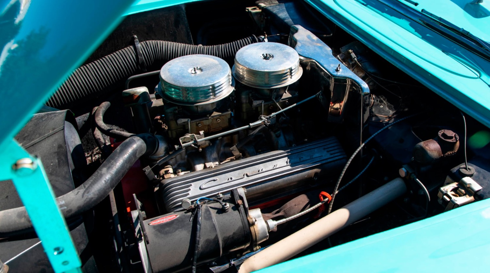

```{r, include=FALSE, echo=FALSE, warning=FALSE, message = FALSE}
#                      -=( Install & Load Package Function )=-
install_load <- function (package1, ...)  {   

   # convert arguments to vector
   packages <- c(package1, ...)

   # start loop to determine if each package is installed
   for(package in packages){

       # if package is installed locally, load
       if(package %in% rownames(installed.packages()))
          do.call('library', list(package))

       # if package is not installed locally, download, then load
       else {
          install.packages(package)
          do.call("library", list(package))
       }
   } 
}
```

```{r, include=FALSE, echo=FALSE, warning=FALSE, message = FALSE}
#Function biar gak perlu ganti backslash (\) jadi slash (/).
path <- function() gsub  ( "\\\\",  "/",  readClipboard ()  )
#Copy path, Panggil function di console
#Copy r path, paste ke var yang diinginkan
```

```{r , include=FALSE, echo=FALSE, warning=FALSE, message = FALSE}
#Set Working Directory
require("knitr")
opts_knit$set(root.dir = "C:/Users/Fathan/Documents/Obsidian Vault/2. Kuliah/Smt 5/8. Pengantar Sains Data/Tugas")
```

```{r , include=FALSE, echo=FALSE, warning=FALSE, message = FALSE}
#Export chart
export.chart <- "C:/Users/Fathan/Documents/Obsidian Vault/2. Kuliah/Smt 5/8. Pengantar Sains Data/Tugas/TM 1/Chart"
```

\newpage

# Pendahuluan


**Link Github :** <https://github.com/Zen-Rofiqy/STA1381-PSD/tree/main/Tugas>

## Tentang Data

**mtcars Dataset**

Dataset mtcars berisi informasi tentang berbagai spesifikasi mobil berdasarkan model dan tahun pembuatannya. Dataset ini digunakan sebagai contoh dalam banyak analisis dan pemodelan statistik.

## Tujuan

-   Membuat analisis regresi klasik, ridge, dan lasso.

-   Membandingkan performa model, peubah yang digunakan.

-   Interpretasi koefisien model terbaiknya.

## Peubah

Terdapat 11 peubah yang terdiri dari:

| **Peubah** |                **Keterangan**                | **Sebagai Peubah** | **Tipe Peubah** |
|:----------:|:--------------------------------------------:|--------------------|-----------------|
|   `mpg`    |     Jarak tempuh per gallon bahan bakar.     | `y`                | Numerik         |
|   `cyl`    |               Jumlah silinder.               | `x1`               | Kategorik       |
|   `disp`   |       Volume mesin (dalam inci kubik).       | `x2`               | Numerik         |
|    `hp`    |                 Tenaga kuda.                 | `x3`               | Numerik         |
|   `drat`   |          Rasio akselerasi belakang.          | `x4`               | Numerik         |
|    `wt`    |      Berat kendaraan (dalam 1000 pon).       | `x5`               | Numerik         |
|   `qsec`   |         Waktu tempuh seperempat mil.         | `x6`               | Numerik         |
|    `vs`    |  Jenis mesin (0 = V-shaped, 1 = straight).   | `x7`               | Kategorik       |
|    `am`    | Jenis transmisi (0 = automatic, 1 = manual). | `x8`               | Kategorik       |
|   `gear`   |                 Jumlah gigi.                 | `x9`               | Kategorik       |
|   `carb`   |              Jumlah karburator.              | `x10`              | Kategorik       |

### Data Preparation {.tabset}

#### Data input

```{r, warning=FALSE, message = FALSE}
raw.data <- mtcars
data <- raw.data
install_load('DT')
datatable(raw.data, filter = 'top', 
          options = list(pageLength = 5))
```

Data ini memiliki 32 baris atau amatan.

#### Data Checking

Melihat tipe data.

```{r}
str(data)
```

Peubah `cyl` , `vs`, `am` , `gear` , dan `carb` harus berupa kategorik. Namun bisa langsung dijadikan sebagai factor agar menjadi peubah dummy.

```{r}
sum(is.na(data))
```

Tidak ada data kosong dalam data ini.

#### Data Cleaning

```{r, warning=FALSE, message = FALSE}
install_load('dplyr')
data <- raw.data %>%
  mutate(
    cyl = as.factor(cyl),
    am = factor(ifelse(am == 0, "Automatic", "Manual")),
    vs = factor(ifelse(vs == 0, "V-shaped", "Straight")),
    gear = as.factor(gear),
    carb = as.factor(carb)
  )
str(data)
```

```{r}
levels(data$cyl); levels(data$vs); levels(data$am); levels(data$gear); levels(data$carb)
```

Peubah `cyl` `vs` dan `am` sudah menjadi peubah dummy. Namun saya ingin mengubah referensi kategorinya dengan kategori terbanyak.

```{r}
datatable(cbind(data %>% count(cyl), data %>% count(gear)))
datatable(cbind(data %>% count(vs), data %>% count(am)))
datatable(data %>% count(carb))
```

Kategori referensi untuk peubah `cyl` adalah jumlah silinder 8, next untuk peubah `gear` adalah jumlah gigi 3, lalu untuk peubah `vs` adalah *'V-shaped', selanjutnya* peubah `am` yakni *'Automatic'*, dan terakhir peubah `carb` adalah jumlah karbulator 2.

```{r}
install_load('forcats')
data <- data %>% 
  mutate(cyl = fct_relevel(cyl, levels(data$cyl)[which.max(table(data$cyl))] ),
         vs  = fct_relevel(vs,  levels(data$vs)[which.max(table(data$vs))] ),
         am  = fct_relevel(am,  levels(data$am)[which.max(table(data$am))] ) ,
         gear  = fct_relevel(gear,  levels(data$gear)[which.max(table(data$gear))] ) ,
         carb  = fct_relevel(carb,  levels(data$carb)[which.max(table(data$carb))] ) )
levels(data$cyl); levels(data$vs); levels(data$am); levels(data$gear); levels(data$carb)
```

Kategori referensi sudah di setting ulang.

# Eksplorasi Data {.tabset}


```{r,  warning=FALSE, message = FALSE}
install_load('ggplot2')
theme1.1 <- list(
  theme(axis.text.x = element_text(angle = 45, hjust = 1, 
                                   margin = margin(b = 10, t=20)),
        axis.text.y = element_text(vjust = 0.5, face = "bold", 
                                   margin = margin(l = 50, r = 20)),
        plot.title = element_text(hjust = 0.5, face = "bold"),
        text = element_text(size = 30),
        plot.subtitle = element_text(hjust = 0.5),
        panel.background = element_rect(fill = 'transparent'),
        plot.background = element_rect(fill='transparent', color=NA),
        panel.grid.major = element_blank(),
        panel.grid.minor = element_blank(),
        axis.line = element_line(linewidth = 1, colour = "black"))
        ) 
theme2 <- list(
  theme(axis.text.x = element_text(angle = 45, hjust = 1, 
                                   margin = margin(b = 10, t=0)),
        axis.text.y = element_text(vjust = 0.5, face = "bold", 
                                   margin = margin(l = 20, r = -40)),
        plot.title = element_text(hjust = 0.5, face = "bold"),
        text = element_text(size = 30),
        plot.subtitle = element_text(hjust = 0.5),
        panel.background = element_rect(fill = 'transparent'),
        plot.background = element_rect(fill='transparent', color=NA),
        panel.grid.major = element_blank(),
        panel.grid.minor = element_blank()
        ) 
)
theme3.2 <- list(
  theme(legend.position = "none",
        plot.title = element_text(hjust = 0.5, face = "bold"),
        text = element_text(size = 30),
        plot.subtitle = element_text(hjust = 0.5),
        panel.background = element_rect(fill = 'transparent', color=NA),
        plot.background = element_rect(fill='transparent', color=NA),
        panel.grid.major = element_line(colour = "grey90"),
        axis.line = element_line(linewidth = 1.5, colour = "black")
        ) 
)
```

## Sebaran Peubah Respon MPG (Jarak tempuh per gallon bahan bakar)


```{r dpi=300, fig.height = 10, fig.width = 20, fig.align = "center", message = FALSE, warning=FALSE}
install_load('ggtext')
chart <-
ggplot(data, aes(x=mpg, 
                     y='')) +
  #Violin
  geom_violin(scale="count", fill='#4692A0', color='black', alpha=0.9, 
                    trim = FALSE) +
  #Boxplot
  geom_boxplot(fill='#49535C', color='black',
                     outlier.size=4, outlier.color='#49535C', 
                     notch=T, width=0.2) +
  #Mean Marker
  stat_summary(fun = mean, geom = "point", shape = 16, size = 4, 
               color = "#AB8264") +
  theme(plot.title = element_text(hjust=0.5),legend.position = "none") +
  labs(x = "\nMPG (Jarak tempuh per gallon bahan bakar)", y='',
       title = "Sebaran Mil Per Galon Mobil",
       subtitle = "Seberapa jauh mobil dapat berjalan dengan satu galon bahan bakar?\n") + theme2 +
  #Tambah Mean Value
  geom_richtext(
    data = data.frame(x = mean(data$mpg), y = 1.25, 
                      label = paste("Mean:", 
                                    round(mean(data$mpg), 
                                          2))),
    aes(x, y, label = label), size = 7, color = "white", 
    fill = "#AB8264", box.color = "white", parse = TRUE
  ) +
  #Tambah panah
  geom_segment(aes(x = mean(data$mpg), 
                   xend = mean(data$mpg), 
                   y = 1, 
                   yend = 1.2225), 
               arrow = arrow(type = "closed", length = unit(0.1, "inches")), 
               lineend = "round", color = "#AB8264", size=1.5)
chart
#Export Chart
ggsave("01_Sebaran Mil Per Galon.png", chart, path = export.chart,
        dpi = 300, height = 10, width = 20)
```

## Hubungan Jumlah Silinder (cyl) dengan MPG


```{r dpi=300, fig.height = 20, fig.width = 15, fig.align = "center", message = FALSE, warning=FALSE}
install_load('ggtext')
chart <-
ggplot(data, aes(x=cyl, 
                     y=mpg)) +
  #Violin
  geom_violin(scale="count", fill='#991B1E', color='black', alpha=0.9, 
                    trim = FALSE) +
  #Boxplot
  geom_boxplot(fill='#FBCE32', color='black',
                     outlier.size=4, outlier.color='#FBCE32', 
                     notch=T, width=0.2) +
  #Mean Marker
  stat_summary(fun = mean, geom = "point", shape = 16, size = 4, 
               color = "black") +
  theme(plot.title = element_text(hjust=0.5),legend.position = "none") +
  labs(x = "\nJumlah Silinder (cyl)", 
       y='MPG (Jarak tempuh per gallon bahan bakar)',
       title = "Hubungan Jumlah Silinder (cyl) dengan MPG",
       subtitle = "Bagaimana ya pola hubungan Jumlah Silinder (cyl) dengan MPG?\n") + theme1.1 
chart
#Export Chart
ggsave("002_Boxplot Jumlah Silinder (cyl) dengan MPG.png", chart, path = export.chart,
        dpi = 300, height = 20, width = 15)
```

Informasi yang diperoleh :

1.  **Jumlah Silinder 8 memiliki rentang sebaran MPG yang lebih rendah yakni kurang lebih 0 sampai 20:** Ini mengindikasikan bahwa kendaraan dengan jumlah silinder 8 cenderung memiliki efisiensi bahan bakar yang lebih rendah, yang tercermin dari rentang MPG yang lebih rendah. Dengan kata lain, kendaraan berjumlah 8 silinder cenderung mengkonsumsi lebih banyak bahan bakar untuk menempuh jarak yang sama dibandingkan dengan kendaraan dengan jumlah silinder yang lebih sedikit.

2.  **Jumlah Silinder 4 memiliki rentang sebaran yang lebih lebar yakni kurang lebih 15 sampai 40:** Ini menunjukkan bahwa kendaraan dengan jumlah silinder 4 memiliki variasi efisiensi bahan bakar yang lebih besar. Beberapa kendaraan dengan 4 silinder dapat sangat efisien (dengan MPG tinggi), sementara yang lain mungkin kurang efisien (dengan MPG rendah). Rentang yang lebih lebar ini bisa mengindikasikan bahwa ada lebih banyak variasi dalam efisiensi bahan bakar di antara kendaraan dengan 4 silinder.

3.  **Jumlah Silinder 6 memiliki rentang sebaran yang paling kecil dari kurang lebih 15 sampai 25:** Ini menunjukkan bahwa kendaraan dengan jumlah silinder 6 memiliki variasi yang lebih terbatas dalam efisiensi bahan bakar. Rentang yang lebih sempit ini menunjukkan bahwa kendaraan dengan 6 silinder cenderung memiliki efisiensi bahan bakar yang serupa dalam kisaran tertentu, dan ada sedikit variasi yang signifikan di antara mereka.

Secara keseluruhan, informasi ini membantu kita memahami bagaimana jumlah silinder kendaraan dapat memengaruhi efisiensi bahan bakar (MPG) mereka. Kendaraan dengan jumlah silinder yang lebih rendah cenderung lebih efisien dalam penggunaan bahan bakar, sementara kendaraan dengan jumlah silinder yang lebih tinggi cenderung lebih boros. Ini adalah informasi yang berguna dalam pemilihan kendaraan berdasarkan efisiensi bahan bakar yang diinginkan.

## Hubungan Volume mesin (disp) dengan MPG


```{r dpi=300, fig.height = 15, fig.width = 15, fig.align = "center", message = FALSE, warning=FALSE}
chart <-
ggplot(data = data, aes(x = disp, y = mpg)) +
  geom_point(alpha = 0.75, size = 7, col="#589E44") +
  geom_smooth(method = "lm", formula = y ~ x, se = FALSE, size = 1,
              col="#589E44") +
  labs(title='Hubungan Volume mesin (disp) dengan MPG',
       subtitle = 'Bagaimana ya pola hubungan Volume mesin (disp) dengan MPG?\n',
    x = "\nVolume mesin (dalam inci kubik)", 
    y = "MPG (Jarak tempuh per gallon bahan bakar)\n") +
  theme3.2 +
  geom_text(aes(x = 300, 
                y = 30, 
                label = paste("R =", round(cor(data$disp, 
                                               data$mpg), 2))),
            color = "black", size = 20)
chart
#Export Chart
ggsave("03_Scatterplot Volume mesin (disp) dengan MPG.png", 
       chart, path = export.chart,
        dpi = 300, height = 15, width = 15)
```

Diperoleh informasi :

-   **"Volume Mesin dengan MPG memiliki pola hubungan linier kuat negatif"**: Ini berarti bahwa terdapat pola hubungan yang kuat dan berbanding terbalik antara volume mesin dan efisiensi bahan bakar yang diukur dalam satuan MPG. Dengan kata lain, semakin besar volume mesin kendaraan, semakin rendah efisiensi bahan bakarnya, dan sebaliknya. Ini adalah hubungan linier negatif karena ketika satu variabel meningkat, variabel lainnya cenderung menurun secara konsisten.

<!-- -->

-   **"dengan nilai korelasi sebesar** $-0.85$**"**: Nilai korelasi adalah ukuran statistik yang mengukur sejauh mana dua variabel berkaitan satu sama lain. Dalam konteks ini, nilai korelasi sebesar $-0.85$ menunjukkan bahwa hubungan antara volume mesin dan MPG sangat kuat. Angka negatif menunjukkan arah hubungan negatif, sesuai dengan pengamatan sebelumnya bahwa semakin besar volume mesin, semakin rendah MPG. Nilai $-0.85$ juga mendekati $-1$, yang mengindikasikan bahwa hubungan ini sangat dekat dengan hubungan linier sempurna (yang akan memiliki nilai $-1$ jika sempurna negatif).

Jadi, kesimpulannya, hasil analisis korelasi ini menunjukkan bahwa pada dataset ini, volume mesin kendaraan memiliki pengaruh kuat dan negatif terhadap efisiensi bahan bakar (MPG). Dengan kata lain, kendaraan dengan volume mesin yang lebih besar cenderung memiliki MPG yang lebih rendah, sementara kendaraan dengan volume mesin yang lebih kecil cenderung memiliki MPG yang lebih tinggi. Ini adalah informasi yang berguna untuk memahami faktor-faktor yang memengaruhi efisiensi bahan bakar kendaraan.

## Hubungan Tenaga kuda (hp) dengan MPG

:strip_icc():format(jpeg)/kly-media-production/medias/4159173/original/031797000_1663226973-liputan6-ford-mustang-dark-horse-01.jpg)

```{r dpi=300, fig.height = 15, fig.width = 15, fig.align = "center", message = FALSE, warning=FALSE}
chart <-
ggplot(data = data, aes(x = hp, y = mpg)) +
  geom_point(alpha = 0.75, size = 7, col="#1E3D73") +
  geom_smooth(method = "lm", formula = y ~ x, se = FALSE, size = 1,
              col="#1E3D73") +
  labs(title='Hubungan Tenaga kuda dengan MPG',
       subtitle = 'Bagaimana ya pola hubungan Tenaga kuda dengan MPG?\n',
    x = "\nTenaga kuda (hp)", 
    y = "MPG (Jarak tempuh per gallon bahan bakar)\n") +
  theme3.2 +
  geom_text(aes(x = 200, 
                y = 30, 
                label = paste("R =", round(cor(data$hp, 
                                               data$mpg), 2))),
            color = "black", size = 20)
chart
#Export Chart
ggsave("04_Scatterplot Tenaga kuda (hp) dengan MPG.png", 
       chart, path = export.chart,
        dpi = 300, height = 15, width = 15)
```

-   **"Tenaga kuda dengan MPG memiliki pola hubungan linier kuat negatif"**: Ini berarti bahwa terdapat pola hubungan yang kuat dan berbanding terbalik antara tenaga kuda mesin kendaraan dan efisiensi bahan bakar yang diukur dalam satuan MPG. Dengan kata lain, semakin tinggi tenaga kuda mesin kendaraan, semakin rendah efisiensi bahan bakarnya, dan sebaliknya. Ini adalah hubungan linier negatif karena ketika satu variabel meningkat, variabel lainnya cenderung menurun secara konsisten.

-   **"dengan nilai korelasi sebesar** $-0.78$**"**: Nilai korelasi adalah ukuran statistik yang mengukur sejauh mana dua variabel berkaitan satu sama lain. Dalam konteks ini, nilai korelasi sebesar $-0.78$ menunjukkan bahwa hubungan antara tenaga kuda dan MPG cukup kuat. Angka negatif menunjukkan arah hubungan negatif, sesuai dengan pengamatan sebelumnya bahwa semakin tinggi tenaga kuda mesin, semakin rendah MPG. Meskipun nilai korelasi ini tidak sekuat $-1$ (hubungan linier sempurna), tetapi tetap kuat dan menunjukkan arah yang konsisten.

Jadi, kesimpulannya, hasil analisis korelasi ini menunjukkan bahwa pada dataset ini, tenaga kuda mesin kendaraan memiliki pengaruh kuat dan negatif terhadap efisiensi bahan bakar (MPG). Dengan kata lain, kendaraan dengan mesin yang lebih bertenaga cenderung memiliki MPG yang lebih rendah, sementara kendaraan dengan mesin yang kurang bertenaga cenderung memiliki MPG yang lebih tinggi. Informasi ini membantu dalam pemahaman faktor-faktor yang memengaruhi efisiensi bahan bakar kendaraan.

## Hubungan Rasio akselerasi belakang (drat) dengan MPG


```{r dpi=300, fig.height = 15, fig.width = 15, fig.align = "center", message = FALSE, warning=FALSE}
chart <-
ggplot(data = data, aes(x = drat, y = mpg)) +
  geom_point(alpha = 0.75, size = 7, col="#29713B") +
  geom_smooth(method = "lm", formula = y ~ x, se = FALSE, size = 1,
              col="#29713B") +
  labs(title='Hubungan Rasio akselerasi belakang dengan MPG',
       subtitle = 'Bagaimana ya pola hubungan Rasio akselerasi belakang dengan MPG?\n',
    x = "\nRasio akselerasi belakang (drat)", 
    y = "MPG (Jarak tempuh per gallon bahan bakar)\n") +
  theme3.2 +
  geom_text(aes(x = 4.5, 
                y = 20, 
                label = paste("R =", round(cor(data$drat, 
                                               data$mpg), 2))),
            color = "black", size = 20)
chart
#Export Chart
ggsave("04_Scatterplot Rasio akselerasi belakang (drat) dengan MPG.png", 
       chart, path = export.chart,
        dpi = 300, height = 15, width = 15)
```

-   **"Rasio akselerasi belakang dengan MPG memiliki pola hubungan linier cukup kuat positif"**: Ini berarti bahwa terdapat pola hubungan yang cukup kuat dan berbanding lurus antara rasio akselerasi belakang dan efisiensi bahan bakar yang diukur dalam satuan MPG. Dengan kata lain, semakin tinggi rasio akselerasi belakang, semakin tinggi juga MPG, dan sebaliknya. Ini adalah hubungan linier positif karena ketika satu variabel meningkat, variabel lainnya juga cenderung meningkat secara konsisten.

-   **"dengan nilai korelasi sebesar** $0.68$**"**: Nilai korelasi adalah ukuran statistik yang mengukur sejauh mana dua variabel berkaitan satu sama lain. Dalam konteks ini, nilai korelasi sebesar $0.68$ menunjukkan bahwa hubungan antara rasio akselerasi belakang dan MPG cukup kuat. Angka positif menunjukkan arah hubungan positif, sesuai dengan pengamatan sebelumnya bahwa semakin tinggi rasio akselerasi belakang, semakin tinggi MPG. Meskipun nilai korelasi ini tidak mencapai $+1$ (hubungan linier sempurna), tetapi tetap cukup kuat dan menunjukkan arah yang konsisten.

Jadi, kesimpulannya, hasil analisis korelasi ini menunjukkan bahwa pada dataset ini, rasio akselerasi belakang memiliki pengaruh cukup kuat dan positif terhadap efisiensi bahan bakar (MPG). Dengan kata lain, kendaraan dengan rasio akselerasi belakang yang lebih tinggi cenderung memiliki MPG yang lebih tinggi, sementara kendaraan dengan rasio akselerasi belakang yang lebih rendah cenderung memiliki MPG yang lebih rendah. Informasi ini membantu dalam pemahaman faktor-faktor yang memengaruhi efisiensi bahan bakar kendaraan.

## Hubungan Berat kendaraan (wt) dengan MPG


```{r dpi=300, fig.height = 15, fig.width = 15, fig.align = "center", message = FALSE, warning=FALSE}
chart <-
ggplot(data = data, aes(x = wt, y = mpg)) +
  geom_point(alpha = 0.75, size = 7, col="#F15E2B") +
  geom_smooth(method = "lm", formula = y ~ x, se = FALSE, size = 1,
              col="#F15E2B") +
  labs(title='Hubungan Berat kendaraan dengan MPG',
       subtitle = 'Bagaimana ya pola hubungan Berat kendaraan dengan MPG?\n',
    x = "\nBerat kendaraan (dalam 1000 pon)", 
    y = "MPG (Jarak tempuh per gallon bahan bakar)\n") +
  theme3.2 +
  geom_text(aes(x = 3.5, 
                y = 30, 
                label = paste("R =", round(cor(data$wt, 
                                               data$mpg), 2))),
            color = "black", size = 20)
chart
#Export Chart
ggsave("05_Scatterplot Berat kendaraan (wt) dengan MPG.png", 
       chart, path = export.chart,
        dpi = 300, height = 15, width = 15)
```

-   **"Berat kendaraan dengan MPG memiliki pola hubungan linier kuat negatif"**: Ini berarti bahwa terdapat pola hubungan yang kuat dan berbanding terbalik antara berat kendaraan dan efisiensi bahan bakar yang diukur dalam satuan MPG. Dengan kata lain, semakin berat kendaraan, semakin rendah MPG, dan sebaliknya. Ini adalah hubungan linier negatif karena ketika satu variabel meningkat, variabel lainnya cenderung menurun secara konsisten.

<!-- -->

-   **"dengan nilai korelasi sebesar** $-0.87$**"**: Nilai korelasi adalah ukuran statistik yang mengukur sejauh mana dua variabel berkaitan satu sama lain. Dalam konteks ini, nilai korelasi sebesar $-0.87$ menunjukkan bahwa hubungan antara berat kendaraan dan MPG sangat kuat dan berbanding terbalik. Angka negatif menunjukkan arah hubungan negatif, sesuai dengan pengamatan sebelumnya bahwa semakin berat kendaraan, semakin rendah MPG.

Jadi, kesimpulannya, hasil analisis korelasi ini menunjukkan bahwa pada dataset ini, berat kendaraan memiliki pengaruh yang sangat kuat dan negatif terhadap efisiensi bahan bakar (MPG). Dengan kata lain, kendaraan yang lebih berat cenderung memiliki MPG yang lebih rendah, sementara kendaraan yang lebih ringan cenderung memiliki MPG yang lebih tinggi. Informasi ini membantu dalam pemahaman faktor-faktor yang memengaruhi efisiensi bahan bakar kendaraan, di mana berat kendaraan adalah salah satu faktor yang signifikan.

## Hubungan Waktu tempuh seperempat mil (qsec) dengan MPG


```{r dpi=300, fig.height = 15, fig.width = 15, fig.align = "center", message = FALSE, warning=FALSE}
chart <-
ggplot(data = data, aes(x = qsec, y = mpg)) +
  geom_point(alpha = 0.75, size = 7, col="#686B7A") +
  geom_smooth(method = "lm", formula = y ~ x, se = FALSE, size = 1,
              col="#686B7A") +
  labs(title='Hubungan Waktu tempuh seperempat mil dengan MPG',
       subtitle = 'Bagaimana ya pola hubungan Waktu tempuh seperempat mil dengan MPG?\n',
    x = "\nWaktu tempuh seperempat mil (qsec)", 
    y = "MPG (Jarak tempuh per gallon bahan bakar)\n") +
  theme3.2 +
  geom_text(aes(x = 21, 
                y = 30, 
                label = paste("R =", round(cor(data$qsec, 
                                               data$mpg), 2))),
            color = "black", size = 20)
chart
#Export Chart
ggsave("06_Scatterplot Waktu tempuh seperempat mil (qsec) dengan MPG.png", 
       chart, path = export.chart,
        dpi = 300, height = 15, width = 15)
```

-   **"Waktu tempuh seperempat mil dengan MPG memiliki pola hubungan linier lemah positif"**: Ini berarti bahwa terdapat pola hubungan antara waktu tempuh seperempat mil dan MPG yang cenderung positif, meskipun pola ini lemah. Dengan kata lain, ada kecenderungan bahwa semakin lama waktu yang dibutuhkan untuk menempuh seperempat mil, semakin tinggi nilai MPG-nya, tetapi hubungannya tidak sangat kuat.

-   **"dengan nilai korelasi sebesar** $0.42$**"**: Nilai korelasi adalah ukuran statistik yang mengukur sejauh mana dua variabel berkaitan satu sama lain. Dalam konteks ini, nilai korelasi sebesar $0.42$ menunjukkan bahwa ada hubungan positif antara waktu tempuh seperempat mil dan MPG, tetapi hubungannya lemah. Angka positif menunjukkan arah hubungan positif, yang sesuai dengan pengamatan bahwa semakin lama waktu tempuh, semakin tinggi MPG, meskipun efeknya tidak kuat.

Jadi, kesimpulannya, hasil analisis korelasi ini menunjukkan bahwa ada hubungan lemah yang positif antara waktu tempuh seperempat mil dan efisiensi bahan bakar (MPG) pada dataset ini. Ini berarti bahwa dalam beberapa kasus, kendaraan dengan waktu tempuh seperempat mil yang lebih lama dapat memiliki nilai MPG yang sedikit lebih tinggi, tetapi efeknya tidak signifikan secara statistik. Faktor-faktor lain kemungkinan memiliki pengaruh yang lebih besar terhadap nilai MPG.

## Hubungan Jenis mesin (vs) dengan MPG


```{r dpi=300, fig.height = 20, fig.width = 15, fig.align = "center", message = FALSE, warning=FALSE}
install_load('ggtext')
chart <-
ggplot(data, aes(x=vs, 
                     y=mpg)) +
  #Violin
  geom_violin(scale="count", fill='#E7BD20', color='black', alpha=0.9, 
                    trim = FALSE) +
  #Boxplot
  geom_boxplot(fill='#707467', color='black',
                     outlier.size=4, outlier.color='#707467', 
                     notch=F, width=0.1) +
  #Mean Marker
  stat_summary(fun = mean, geom = "point", shape = 16, size = 4, 
               color = "black") +
  theme(plot.title = element_text(hjust=0.5),legend.position = "none") +
  labs(x = "\nJenis mesin (V-shaped atau straight)", 
       y='MPG (Jarak tempuh per gallon bahan bakar)',
       title = "Hubungan Jenis mesin dengan MPG",
       subtitle = "Bagaimana ya pola hubungan Jenis mesin dengan MPG?\n") + theme1.1 
chart
#Export Chart
ggsave("07_Boxplot Jenis mesin dengan MPG.png", chart, path = export.chart,
        dpi = 300, height = 20, width = 15)
```

Diperoleh informasi :

-   **"Jenis Mesin V-Shaped memiliki bentuk sebaran yang cukup normal"**: Ini mengindikasikan bahwa sebaran data MPG untuk mobil dengan jenis mesin V-Shaped cenderung lebih terkonsentrasi atau memiliki bentuk yang lebih simetris, mirip dengan distribusi normal atau lonceng. Ini berarti bahwa sebagian besar mobil dengan jenis mesin V-Shaped memiliki MPG dalam kisaran yang relatif kecil, yakni sekitar 0 hingga 30.

<!-- -->

-   **"dengan rentang sebaran MPG yang lebih rendah yakni kurang lebih 0 sampai 30"**: Rentang sebaran MPG adalah kisaran nilai MPG dari yang terendah hingga yang tertinggi dalam kelompok ini. Jadi, mobil dengan jenis mesin V-Shaped umumnya memiliki MPG antara 0 hingga 30, yang menunjukkan tingkat efisiensi bahan bakar yang lebih rendah.

-   **"Sedangkan untuk mobil yang Jenis mesin nya Straight memiliki bentuk sebaran yang cenderung menjulur ke kanan"**: Ini menggambarkan bahwa sebaran data MPG untuk mobil dengan jenis mesin Straight cenderung memiliki ekor yang lebih panjang di sebelah kanan distribusi, yang dapat menunjukkan adanya outlier (pencilan) dengan nilai MPG yang tinggi.

-   **"dengan rentang sebaran yang lebih lebar yakni kurang lebih 10 sampai 45"**: Dalam hal ini, rentang sebaran MPG untuk mobil dengan jenis mesin Straight lebih luas, yaitu berkisar antara 10 hingga 45. Ini menunjukkan bahwa terdapat variasi yang lebih besar dalam efisiensi bahan bakar untuk mobil-mobil ini, dengan beberapa mobil yang memiliki MPG yang cukup tinggi, meskipun ada beberapa pencilan di sisi tinggi distribusi.

Jadi, kesimpulannya, analisis ini mengindikasikan perbedaan dalam sebaran data MPG antara dua jenis mesin, di mana jenis mesin V-Shaped cenderung memiliki rentang sebaran yang lebih rendah dan bentuk yang lebih normal, sementara jenis mesin Straight memiliki rentang sebaran yang lebih lebar dan cenderung memiliki outlier (pencilan) dengan nilai MPG yang tinggi.

## Hubungan Jenis transmisi (am) dengan MPG


```{r dpi=300, fig.height = 20, fig.width = 15, fig.align = "center", message = FALSE, warning=FALSE}
chart <-
ggplot(data, aes(x=am, 
                     y=mpg)) +
  #Violin
  geom_violin(scale="count", fill='#DE6B26', color='black', alpha=0.9, 
                    trim = FALSE) +
  #Boxplot
  geom_boxplot(fill='white', color='black',
                     outlier.size=4, outlier.color='white', 
                     notch=F, width=0.1) +
  #Mean Marker
  stat_summary(fun = mean, geom = "point", shape = 16, size = 4, 
               color = "black") +
  theme(plot.title = element_text(hjust=0.5),legend.position = "none") +
  labs(x = "\nJenis transmisi (Automatic atau Manual)", 
       y='MPG (Jarak tempuh per gallon bahan bakar)',
       title = "Hubungan Jenis transmisi dengan MPG",
       subtitle = "Bagaimana ya pola hubungan Jenis transmisi dengan MPG?\n") + theme1.1 
chart
#Export Chart
ggsave("08_Boxplot Jenis transmisi dengan MPG.png", chart, path = export.chart,
        dpi = 300, height = 20, width = 15)
```

Diperoleh Informasi :

-   **"Jenis Transmisi Automatic memiliki bentuk sebaran yang cukup normal"**: Ini mengindikasikan bahwa sebaran data MPG untuk mobil dengan jenis transmisi Automatic cenderung lebih terkonsentrasi atau memiliki bentuk yang lebih simetris, mirip dengan distribusi normal atau lonceng. Ini berarti bahwa sebagian besar mobil dengan jenis transmisi Automatic memiliki MPG dalam kisaran yang relatif kecil, yakni sekitar 5 hingga 30.

-   **"dengan rentang sebaran MPG yang lebih rendah yakni kurang lebih 5 sampai 30"**: Rentang sebaran MPG adalah kisaran nilai MPG dari yang terendah hingga yang tertinggi dalam kelompok ini. Jadi, mobil dengan jenis transmisi Automatic umumnya memiliki MPG antara 5 hingga 30, yang menunjukkan tingkat efisiensi bahan bakar yang lebih rendah.

-   **"Sedangkan untuk mobil yang Jenis Transmisi Manual memiliki bentuk sebaran yang cenderung menjulur ke kanan"**: Ini menggambarkan bahwa sebaran data MPG untuk mobil dengan jenis transmisi Manual cenderung memiliki ekor yang lebih panjang di sebelah kanan distribusi, yang dapat menunjukkan adanya outlier (pencilan) dengan nilai MPG yang tinggi.

-   **"dengan rentang sebaran yang lebih lebar yakni kurang lebih 0 sampai 45"**: Dalam hal ini, rentang sebaran MPG untuk mobil dengan jenis transmisi Manual lebih luas, yaitu berkisar antara 0 hingga 45. Ini menunjukkan bahwa terdapat variasi yang lebih besar dalam efisiensi bahan bakar untuk mobil-mobil ini, dengan beberapa mobil yang memiliki MPG yang cukup tinggi, meskipun ada beberapa pencilan di sisi tinggi distribusi.

Jadi, kesimpulannya, analisis ini mengindikasikan perbedaan dalam sebaran data MPG antara dua jenis transmisi, di mana jenis Transmisi Automatic cenderung memiliki rentang sebaran yang lebih rendah dan bentuk yang lebih normal, sementara jenis Transmisi Manual memiliki rentang sebaran yang lebih lebar dan cenderung memiliki outlier (pencilan) dengan nilai MPG yang tinggi.

## Hubungan Jumlah gigi (gear) dengan MPG

{width="625"}

```{r dpi=300, fig.height = 20, fig.width = 15, fig.align = "center", message = FALSE, warning=FALSE}
chart <-
ggplot(data, aes(x=gear, 
                     y=mpg)) +
  #Violin
  geom_violin(scale="count", fill='#0677AB', color='black', alpha=0.9, 
                    trim = FALSE) +
  #Boxplot
  geom_boxplot(fill='#CED3CE', color='black',
                     outlier.size=4, outlier.color='#CED3CE', 
                     notch=F, width=0.1) +
  #Mean Marker
  stat_summary(fun = mean, geom = "point", shape = 16, size = 4, 
               color = "black") +
  theme(plot.title = element_text(hjust=0.5),legend.position = "none") +
  labs(x = "\nJumlah gigi (gear)", 
       y='MPG (Jarak tempuh per gallon bahan bakar)',
       title = "Hubungan Jumlah gigi dengan MPG",
       subtitle = "Bagaimana ya pola hubungan Jumlah gigi dengan MPG?\n") + theme1.1 
chart
#Export Chart
ggsave("09_Boxplot Jumlah gigi (gear) dengan MPG.png", chart, path = export.chart,
        dpi = 300, height = 20, width = 15)
```

Diperoleh informasi :\
**"Semua jumlah gigi Mobil memiliki bentuk sebaran yang menjulur ke kanan"**: Ini menggambarkan bahwa sebaran data MPG untuk mobil-mobil dengan berbagai jumlah gigi transmisi cenderung memiliki ekor yang lebih panjang di sebelah kanan distribusi, yang dapat menunjukkan adanya outlier (pencilan) dengan nilai MPG yang tinggi.

-   **"Mobil yang memiliki jumlah gigi 3 memiliki rentang sebaran MPG yang paling rendah yakni kurang lebih 5 sampai 25"**: Rentang sebaran MPG untuk mobil dengan 3 gigi transmisi adalah yang paling terbatas, yaitu antara 5 hingga 25. Ini menunjukkan bahwa mobil-mobil dengan 3 gigi transmisi cenderung memiliki efisiensi bahan bakar yang lebih rendah dan lebih terkonsentrasi dalam kisaran tersebut.

-   **"Sedangkan untuk mobil yang jumlah gigi nya 4 memiliki rentang sebaran yang lebih lebar yakni kurang lebih 10 sampai 40"**: Rentang sebaran MPG untuk mobil dengan 4 gigi transmisi lebih luas dibandingkan dengan yang memiliki 3 gigi. Ini menunjukkan bahwa mobil-mobil dengan 4 gigi transmisi memiliki variasi yang lebih besar dalam efisiensi bahan bakar, dengan beberapa mobil yang memiliki MPG yang cukup tinggi.

-   **"Dan terakhir untuk mobil dengan jumlah gigi 5 memiliki rentang paling lebar yakni kurang lebih 3 sampai 45"**: Mobil dengan 5 gigi transmisi memiliki rentang sebaran MPG yang paling luas di antara semua kategori, yakni berkisar antara 3 hingga 45. Ini menunjukkan bahwa mobil-mobil dengan 5 gigi transmisi memiliki variasi yang sangat besar dalam efisiensi bahan bakar, dengan beberapa mobil yang memiliki MPG yang sangat tinggi dan beberapa yang memiliki MPG yang rendah.

Jadi, kesimpulannya, analisis ini mengindikasikan bahwa mobil dengan berbagai jumlah gigi transmisi memiliki perbedaan dalam sebaran efisiensi bahan bakarnya, di mana mobil dengan lebih banyak gigi transmisi cenderung memiliki variasi yang lebih besar dalam MPG, sementara mobil dengan jumlah gigi transmisi yang lebih rendah memiliki kisaran yang lebih terbatas.

## Hubungan Jumlah karburator (carb) dengan MPG



```{r dpi=300, fig.height = 20, fig.width = 15, fig.align = "center", message = FALSE, warning=FALSE}
chart <-
ggplot(data, aes(x=carb, 
                     y=mpg)) +
  #Violin
  geom_violin(scale="count", fill='#35BFC4', color='black', alpha=0.9, 
                    trim = FALSE) +
  #Boxplot
  geom_boxplot(fill='#B8C3C6', color='black',
                     outlier.size=4, outlier.color='#B8C3C6', 
                     notch=F, width=0.1) +
  #Mean Marker
  stat_summary(fun = mean, geom = "point", shape = 16, size = 4, 
               color = "black") +
  theme(plot.title = element_text(hjust=0.5),legend.position = "none") +
  labs(x = "\nJumlah karburator (carb)", 
       y='MPG (Jarak tempuh per gallon bahan bakar)',
       title = "Hubungan Jumlah karburator dengan MPG",
       subtitle = "Bagaimana ya pola hubungan Jumlah karburator dengan MPG?\n") + theme1.1 
chart
#Export Chart
ggsave("10_Boxplot Jumlah karburator (carb) dengan MPG.png", chart, path = export.chart,
        dpi = 300, height = 20, width = 15)
```

Diperoleh informasi :

-   **"Mobil yang memiliki jumlah karburator 2 memiliki bentuk sebaran normal dengan rentang sebaran MPG yang paling rendah yakni kurang lebih 5 sampai 40"**: Mobil dengan dua karburator memiliki sebaran MPG yang relatif normal dan terkonsentrasi dalam rentang antara 5 hingga 40. Hal ini menunjukkan bahwa mobil-mobil dengan dua karburator cenderung memiliki tingkat efisiensi bahan bakar yang lebih stabil dan terdistribusi secara merata.

-   **"Sedangkan untuk mobil yang jumlah karburator nya 1 memiliki bentuk sebaran menjulur ke kanan dengan rentang sebaran kurang lebih 5 sampai 45"**: Mobil dengan satu karburator memiliki sebaran MPG yang lebih cenderung menjulur ke kanan, menunjukkan adanya beberapa outlier (pencilan) dengan nilai MPG yang tinggi di luar sebaran utama. Rentang sebarannya berkisar antara 5 hingga 45, yang menandakan variasi yang lebih besar dalam efisiensi bahan bakar.

-   **"Ada jumlah karburator 3 yang rentang nya kecil yakni kurang lebih 5 sampai 20"**: Mobil dengan tiga karburator memiliki sebaran MPG yang lebih terbatas, dengan rentang sebaran yang sempit antara 5 hingga 20. Ini menunjukkan bahwa mobil-mobil dengan tiga karburator cenderung memiliki efisiensi bahan bakar yang lebih rendah.

-   **"Untuk mobil degan jumlah karburator 4 memiliki rentang kurang lebih 3 sampai 28"**: Mobil dengan empat karburator memiliki rentang sebaran MPG antara 3 hingga 28. Ini menunjukkan variasi yang cukup besar dalam efisiensi bahan bakar, dengan beberapa mobil yang memiliki efisiensi yang lebih tinggi dan beberapa yang lebih rendah.

-   **"Dan terakhir untuk mobil dengan jumlah karburator 6 dan 8 tidak memiliki sebaran karena masing-masing hanya memiliki satu data"**: Mobil dengan enam dan delapan karburator hanya memiliki satu data masing-masing, sehingga tidak ada sebaran yang dapat diamati untuk kategori ini.

Dengan demikian, analisis ini memberikan gambaran tentang hubungan antara jumlah karburator dan efisiensi bahan bakar, menunjukkan bahwa jumlah karburator dapat memengaruhi variasi efisiensi bahan bakar dalam mobil.

# Regresi Klasik (OLS) {.tabset}


## Model Regresi Awal

```{r}
model.ols <- lm(mpg ~ cyl + disp + hp + drat + wt + qsec + vs + am + gear + carb, data=data)
summary(model.ols)
```

Diperoleh model dugaan :

$$\begin{equation}
\begin{aligned}
\hat{\text{mpg}}_i = & 22.56362 +0.33616 \cdot \text{cyl4} -2.31253 \cdot \text{cyl6} + 0.03555\cdot \text{disp} -0.07051 \cdot \text{hp} + 1.18283 \cdot \text{drat} -4.52978 \cdot \text{wt} \\
            & + 0.36784 \cdot \text{qsec} + 1.93085 \cdot \text{vsStraight} + 1.21212 \cdot \text{amManual} + 1.11435 \cdot \text{gear4} + 2.52840 \cdot \text{gear5} \\ & + 0.97935 \cdot \text{carb1} + 3.97899 \cdot \text{carb3} + 2.07078 \cdot \text{carb4} + 5.45692 \cdot \text{carb6} + 8.22977\cdot \text{carb8} + \epsilon_i
\end{aligned}
\end{equation}
$$

### Interpretasi {.tabset}

#### Coefficients:

1.  **Intercept (Intersep)**: Koefisien intercept adalah $22.56362$. Ini adalah nilai mpg ketika semua variabel independen (cyl, disp, hp, drat, wt, qsec, vs, am, gear, carb) adalah nol. Namun, dalam konteks ini, nilai-nilai nol untuk variabel-variabel independen tidak memiliki interpretasi praktis yang berguna karena mobil yang memiliki nol silinder, nol volume mesin, nol tenaga kuda, dan sebagainya adalah situasi yang tidak mungkin dalam dunia nyata.

2.  **Variabel Cylinder (cyl)**: Koefisien untuk variabel independen cyl adalah $0.33616$. Ini mengindikasikan bahwa jika kita membandingkan mobil yang memiliki 4 silinder (cyl=4) dengan mobil yang memiliki 8 silinder (cyl=8), maka rata-rata mpg pada mobil 4 silinder cenderung lebih tinggi sekitar $0.33616$ unit. Namun, perubahan ini tidak signifikan secara statistik karena nilainya memiliki nilai p yang tinggi (0.9632).

3.  **Variabel Displacement (disp)**: Koefisien untuk variabel independen disp adalah $0.03555$. Ini berarti bahwa dengan setiap penambahan satu unit pada volume mesin (displacement), rata-rata mpg cenderung meningkat sebesar $0.03555$ unit. Namun, perubahan ini juga tidak signifikan secara statistik.

4.  **Variabel Horsepower (hp)**: Koefisien untuk variabel independen hp adalah $-0.07051$. Ini mengindikasikan bahwa dengan setiap penambahan satu unit pada tenaga kuda (horsepower), rata-rata mpg cenderung berkurang sebesar $-0.07051$ unit. Meskipun nilainya signifikan pada tingkat $0.1$, perubahan ini masih dianggap tidak signifikan secara statistik pada tingkat $0.05$.

5.  **Variabel Rear Axle Ratio (drat)**: Koefisien untuk variabel independen drat adalah $1.18283$. Ini berarti bahwa dengan setiap peningkatan satu unit pada rasio poros belakang (rear axle ratio), rata-rata mpg cenderung meningkat sebesar $1.18283$ unit. Namun, perubahan ini juga tidak signifikan secara statistik.

6.  **Variabel Weight (wt)**: Koefisien untuk variabel independen wt adalah $-4.52978$. Ini adalah salah satu koefisien yang paling signifikan dalam model ini. Ini menunjukkan bahwa dengan setiap penambahan satu unit pada berat kendaraan (weight), rata-rata mpg cenderung berkurang sebesar $-4.52978$ unit. Variabel ini memiliki pengaruh yang signifikan terhadap mpg.

7.  **Variabel Quarter Mile Time (qsec)**: Koefisien untuk variabel independen qsec adalah $0.36784$. Ini menunjukkan bahwa dengan setiap peningkatan satu unit pada waktu tempuh seperempat mil (quarter mile time), rata-rata mpg cenderung meningkat sebesar $0.36784$ unit. Namun, perubahan ini tidak signifikan secara statistik.

8.  **Variabel V/S (vs)**: Koefisien untuk variabel independen vs adalah $1.93085$. Ini mengindikasikan bahwa jika jenis mesin adalah V-shaped (vs=V-shaped), rata-rata mpg cenderung lebih tinggi sekitar $1.93085$ unit dibandingkan dengan jenis mesin straight (vs=Straight). Namun, efek ini juga tidak signifikan secara statistik.

9.  **Variabel Transmission (am)**: Koefisien untuk variabel independen am adalah $1.21212$. Ini berarti bahwa jika transmisi adalah otomatis (am=Manual), rata-rata mpg cenderung lebih tinggi sekitar $1.21212$ unit dibandingkan dengan transmisi manual (am=Automatic). Namun, variabel ini tidak memiliki pengaruh yang signifikan pada mpg secara statistik.

10. **Variabel Gear (gear)**: Koefisien untuk variabel independen gear adalah $0.65541$. Ini menunjukkan bahwa jika jumlah gigi adalah 1 unit lebih tinggi (misalnya dari 3 ke 4), rata-rata mpg cenderung lebih tinggi sekitar $0.65541$ unit. Namun, perubahan ini tidak signifikan secara statistik.

11. **Variabel Carburetor (carb)**: Koefisien untuk variabel independen carb adalah $-0.19942$. Ini mengindikasikan bahwa dengan setiap penambahan satu unit pada jumlah karburator, rata-rata mpg cenderung berkurang sebesar $-0.19942$ unit. Namun, perubahan ini juga tidak signifikan secara statistik.

#### Statistik Model :

-   **Residual Standard Error** (Residual SE atau RSE):\
    Residual SE mengukur seberapa jauh perbedaan antara nilai-nilai aktual (data sebenarnya) dan nilai-nilai yang diprediksi oleh model (data yang diestimasi oleh model). Ini adalah estimasi dari deviasi standar dari residual (kesalahan prediksi) dalam model. **Semakin kecil nilai RSE**, **semakin baik** model memfitting data. RSE yang diperoleh adalah sekitar $2.833$, yang mengindikasikan bahwa rata-rata residual sekitar $2.833$ unit dari nilai aktual.

-   **Multiple R-squared** (R-squared):\
    R-squared mengukur seberapa baik variabilitas dalam variabel respons (dalam hal ini, **`mpg`**) dapat dijelaskan oleh model. Nilai R-squared berkisar antara 0 hingga 1, di mana 0 berarti model tidak menjelaskan variasi sama sekali dan 1 berarti model menjelaskan semua variasi. Nilai R-squared sebesar $0.8931$ mengindikasikan bahwa **sekitar** $89.31\%$ variabilitas dalam **`mpg`** **dapat dijelaskan** oleh variabel-**variabel independen** dalam model.

-   **Adjusted R-squared**:\
    Adjusted R-squared adalah modifikasi dari R-squared yang mempertimbangkan jumlah variabel independen dalam model. Ini adalah ukuran yang **lebih kritis** karena memasukkan kompleksitas model. Nilai Adjusted R-squared sebesar $0.779$ menunjukkan bahwa sekitar $77.9\%$ variabilitas dalam **`mpg`** d**apat dijelaskan** oleh variabel-**variabel independen** dalam model, dengan mempertimbangkan **kompleksitas model**.

-   **F-statistic**:\
    F-statistic adalah statistik yang digunakan untuk menguji apakah model regresi secara keseluruhan signifikan atau tidak. **Semakin tinggi** nilai **F-statistic** dan **semakin rendah** nilai **p-value** yang terkait, **semakin signifikan** model regresi secara keseluruhan. F-statistic yang diperoleh sebesar $7.83$ dan nilai *p-value* yang sangat rendah ($0.000124$) menunjukkan bahwa model diatas secara keseluruhan adalah model yang **signifikan** secara statistik, yang berarti bahwa setidaknya salah satu variabel independen memiliki efek signifikan pada variabel respons (**`mpg`**ons (**`mpg`**) dalam model ini.

#### Simpulan

Hasil dari koefisien regresi menunjukkan bahwa variabel `wt` (berat kendaraan) memiliki **pengaruh negatif yang kuat** terhadap `mpg` (*mileage per gallon*).

> Ini berarti **semakin berat** kendaraan, **semakin rendah efisiensi** bahan bakarnya.

Model regresi secara keseluruhan memiliki tingkat kecocokan yang baik terhadap data, yang dilihat dari nilai *Adjusted R-squared* yang tinggi ($0.779$). Ini berarti sekitar $77.9\%$ variasi dalam `mpg` **dapat dijelaskan** oleh variabel-variabel prediktor yang ada dalam model, dengan mempertimbangkan **kompleksitas model**.

Selain itu, hasil analisis *F-statistic* menunjukkan bahwa model ini secara keseluruhan adalah **model yang signifikan** secara statistik dalam menjelaskan variasi `mpg`.

## Pengecekan Multikolinieritas

[Ref1](https://stats.stackexchange.com/questions/559924/which-threshold-should-i-use-for-gvif1-2%E2%8B%85df-variance-inflation-factor) ,[Ref2](https://web.vu.lt/mif/a.buteikis/wp-content/uploads/PE_Book/4-5-Multiple-collinearity.html).

```{r}
car::vif(model.ols)
```

1.  **cyl**: $GVIF^{\dfrac{1}{2*Df}}$ = $3.364380$. Nilai ini kurang dari 5, yang merupakan batas aturan praktis yang biasa digunakan untuk VIF. Oleh karena itu, variabel **`cyl`** dapat dianggap **tidak** memiliki masalah **multikolinearitas** yang signifikan.

2.  **disp**: $GVIF^{\dfrac{1}{2*Df}}$ = $7.769536$. Nilai ini lebih besar dari 5, tetapi masih di bawah 10. Ini menunjukkan bahwa variabel **`disp`** mungkin memiliki **sedikit** **masalah multikolinearitas**, tetapi masalah ini **tidak signifikan** secara dramatis.

3.  **hp**: $GVIF^{\dfrac{1}{2*Df}}$ = $5.312210$. Nilai ini lebih besar dari 5, tetapi masih di bawah 10. Seperti **`disp`**, ini juga menunjukkan bahwa variabel **`hp`** mungkin memiliki **sedikit masalah multikolinearitas**, tetapi **tidak signifikan** secara dramatis.

4.  **drat**: $GVIF^{\dfrac{1}{2*Df}}$ = $2.609533$. Nilai ini jauh lebih rendah dari 5, yang menunjukkan bahwa variabel **`drat`** **tidak** memiliki masalah **multikolinearitas** yang signifikan.

5.  **wt**: $GVIF^{\dfrac{1}{2*Df}}$ = $4.881683$. Nilai ini jauh lebih rendah dari 5, yang menunjukkan bahwa variabel `wt` **tidak** memiliki masalah **multikolinearitas** yang signifikan.

6.  **qsec**: $GVIF^{\dfrac{1}{2*Df}}$ = $3.284842$. Nilai ini kurang dari 5, yang menunjukkan bahwa variabel **`qsec`** **tidak** memiliki masalah **multikolinearitas** yang signifikan.

7.  **vs**: $GVIF^{\dfrac{1}{2*Df}}$ = $2.843970$. Nilai ini jauh lebih rendah dari 5, yang menunjukkan bahwa variabel **`vs`** **tidak** memiliki masalah **multikolinearitas** yang signifikan.

8.  **am**: $GVIF^{\dfrac{1}{2*Df}}$ = $3.151269$. Nilai ini kurang dari 5, yang menunjukkan bahwa variabel **`am`** **tidak** memiliki masalah **multikolinearitas** yang signifikan.

9.  **gear**: $GVIF^{\dfrac{1}{2*Df}}$ = $2.670408$. Nilai ini jauh lebih rendah dari 5, yang menunjukkan bahwa variabel **`gear`** **tidak** memiliki masalah **multikolinearitas** yang signifikan.

10. **carb**: $GVIF^{\dfrac{1}{2*Df}}$ = $1.862838$. Nilai ini jauh lebih rendah dari 5, yang menunjukkan bahwa variabel **`carb`** **tidak** memiliki masalah **multikolinearitas** yang signifikan.

Berdasarkan analisis di atas, sebagian besar variabel tidak menunjukkan masalah multikolinearitas yang signifikan. Variabel **`disp`** dan **`hp`** mungkin memiliki sedikit masalah multikolinearitas, tetapi tidak signifikan secara dramatis.

## Seleksi Peubah Penjelas

### Metode {.tabset}

#### Best Subset

```{r}
ols.bs <- as.data.frame( olsrr::ols_step_best_subset(model.ols)  )
```

```{r dpi=300, fig.height = 9, fig.width = 16, fig.align = "center", message = FALSE, warning=FALSE}
chart <- 
ggplot(ols.bs, aes(x = n, y = aic)) +
  geom_line(size=1) +
  geom_point(size=4) +
  geom_point(data = ols.bs[which.min(ols.bs$aic), ], color = "#F15E2B", size = 8) +
  theme(plot.title = element_text(hjust=0.5),legend.position = "none") +
  labs(x = "Jumlah Variabel Prediktor", 
       y='AIC',
       title = "Pergerakan Nilai AIC",
       subtitle = "Untuk Model terbaik, Nilai AIC yang terkecilnya berapa sih?\n") + theme1.1 +
  theme(axis.text.y = element_text(vjust = 0.5, face = "bold", 
                                   margin = margin(l = 20, r = 10))) +
  geom_text(aes(x = ols.bs[which.min(ols.bs$aic), ]$n + 1, 
                y = ols.bs[which.min(ols.bs$aic), ]$aic +1, 
                label = paste0("AIC = ", round(ols.bs[which.min(ols.bs$aic), ]$aic, 2),
                              "\nModel(", ols.bs[which.min(ols.bs$aic), ]$mindex, ")")),
            color = "#F15E2B", size = 8) 

chart
#Export Chart
ggsave("11_Pergerakan Nilai AIC.png", chart, path = export.chart,
        dpi = 300, height = 9, width = 16)
```

```{r dpi=300, fig.height = 9, fig.width = 16, fig.align = "center", message = FALSE, warning=FALSE}
chart <- 
ggplot(ols.bs, aes(x = n, y = rsquare)) +
  geom_line(size=1) +
  geom_point(size=4) +
  geom_point(data = ols.bs[which.max(ols.bs$rsquare), ], color = "#589E44", size = 8) +
  geom_point(data = ols.bs[which(ols.bs$mindex  == 4), ], color = "#F15E2B", size = 5) +
  theme(plot.title = element_text(hjust=0.5),legend.position = "none") +
  labs(x = "Jumlah Variabel Prediktor", 
       y='Rsquare',
       title = "Pergerakan Nilai Rsquare",
       subtitle = "Untuk Model terbaik, Nilai Rsquare yang terbesarnya berapa sih?\n") + 
  theme1.1 +
  theme(axis.text.y = element_text(vjust = 0.5, face = "bold", 
                                   margin = margin(l = 20, r = 10))) +
  geom_text(aes(x = ols.bs[which.max(ols.bs$rsquare), ]$n -0.5, 
                y = ols.bs[which.max(ols.bs$rsquare), ]$rsquare -0.02, 
                label = paste0("Rsquare = ", 
                              round(ols.bs[which.max(ols.bs$rsquare), ]$rsquare, 2),
                              "\nModel(", ols.bs[which.max(ols.bs$rsquare), ]$mindex, ")")),
            color = "#589E44", size = 8) + 
  geom_text(aes(x = ols.bs[which(ols.bs$mindex == 4) , ]$n, 
              y = ols.bs[which(ols.bs$mindex == 4), ]$rsquare -0.015, 
              label = paste0("Rsquare = ", round(ols.bs[which(ols.bs$mindex  == 4),
                                                        ]$rsquare, 2),
                            "\nModel(", ols.bs[which(ols.bs$mindex  == 4), 
                                               ]$mindex, ")")),
          color = "#F15E2B", size = 5) 

chart
#Export Chart
ggsave("12_Pergerakan Nilai Rsquare.png", chart, path = export.chart,
        dpi = 300, height = 9, width = 16)
```

Pada pemilihan peubah dengan teknik `best subset` terlihat nilai **AIC** paling rendah serta **Adj. R-Squared** paling tinggi dimiliki oleh **model ke-4**.

```{r}
ols.bs[which(ols.bs$mindex == 4) , ]$predictors
```

Pada model ini, hanya terdapat peubah `cyl` (Jumlah silinder), `hp` (Horse Power/Tenaga Kuda), `wt` (Berat Mobil), dan `am` (Jenis transmisi, Automatic atau Manual) .

#### Forward Selection

```{r}
ols.fs <- olsrr::ols_step_forward_p(model.ols); ols.fs
```

Hasil metode Stepwise Forward juga menunjukkan berbeda. Langkah paling optimal berada pada langkah ke-5 (model 5). Model 5 mirip dengan model 4, namun ada tambahan peubah `vs` .

#### Backward Elemination

```{r}
ols.be <- olsrr::ols_step_backward_p(model.ols); ols.be
```

Pada metode Stepwise Backward, peubah yang dibuang adalah `carb`, `disp`, `gear`, `drat`, dan `sec` dikeluarkan dari model.

```{r}
colnames(data %>% select(-carb, -disp, -gear, -drat, -qsec, -mpg))
```

#### Kesimpulan

Walaupun Stepwise Forward, dan Stepwise Backward menghasilkan kesimpulan yang sama yaitu: Model terbaik diperoleh dengan hanya memasukkan peubah `cyl`, `hp` , `wt`, `vs` , dan `am`. Tapi Pada metode Best Subset nilai AIC model 4 dan 5 berbeda jauh. Sehingga lebih baik menggunakan model yang dihasilkan oleh Best Subset yakni model dengan peubah `cyl`, `hp` , `wt`, dan `am`.

## Model Baru

```{r}
best.model.ols <- lm(mpg ~ cyl + hp + wt + am, data=data)
summary(best.model.ols)
```

Diperoleh Model dugaan baru :

$$\begin{equation}
\begin{aligned}
\hat{\text{mpg}}_i = & 31.54465 +2.16368 \cdot \text{cyl4} -0.86767 \cdot \text{cyl6}  -0.03211 \cdot \text{hp} -2.49683 \cdot \text{wt} +1.80921 \cdot \text{amManual} + \epsilon_i
\end{aligned}
\end{equation}
$$

## Uji Asumsi

[Ref](https://rpubs.com/farhanabdillah/psd-tm-uts)

```{r , fig.height = 9, fig.width = 13, fig.align = "center", message = FALSE, warning=FALSE}
layout(matrix(c(1, 2, 
                3, 3), nrow = 2, byrow = TRUE))
plot(best.model.ols, 1)
plot(best.model.ols,2) 
plot(x = 1:dim(data)[1],
     y = best.model.ols$residuals,
     type = 'b', 
     ylab = "Residuals",
     xlab = "Observation") 
```

```{r, warning=FALSE, message = FALSE}
install_load('randtests','lmtest','car')
# Melakukan uji asumsi
t_test <- t.test(best.model.ols$residuals, mu = 0, conf.level = 0.95)
runs_test <- runs.test(best.model.ols$residuals)
bp_test <- ncvTest(best.model.ols)
shapiro_test <- shapiro.test(best.model.ols$residuals)

# Membuat dataframe hasil
asumsi <- data.frame(
  "Asumsi" = c("Nilai harapan sisaan sama dengan nol", "Sisaan saling bebas", "Ragam Sisaan Homogen", "Normalitas Sisaan"),
  "Jenis Uji" = c("t-test", "Runs Test", "Non Constant Variance Test", "Shapiro-Wilk Test"),
  "p-value" = c(t_test$p.value, runs_test$p.value, bp_test$p, shapiro_test$p.value),
  "Kesimpulan" = c(ifelse(t_test$p.value < 0.05, "Tidak Terpenuhi", "Terpenuhi"),
                   ifelse(runs_test$p.value < 0.05, "Tidak Terpenuhi", "Terpenuhi"),
                   ifelse(bp_test$p < 0.05, "Tidak Terpenuhi", "Terpenuhi"),
                   ifelse(shapiro_test$p.value < 0.05, "Tidak Terpenuhi", "Terpenuhi"))
)
datatable(asumsi)
```

## Weighted Least Square

```{r}
weights <- 1 / lm(abs(best.model.ols$residuals) ~ best.model.ols$fitted.values)$fitted.values^2

best.model.ols_wls <- lm(mpg ~ cyl + hp + wt + am, data=data, weights = weights)
summary(best.model.ols_wls)
```

```{r}
# Melakukan uji asumsi
t_test <- t.test(best.model.ols_wls$residuals, mu = 0, conf.level = 0.95)
runs_test <- runs.test(best.model.ols_wls$residuals)
bp_test <- ncvTest(best.model.ols_wls)
shapiro_test <- shapiro.test(best.model.ols_wls$residuals)

# Membuat dataframe hasil
asumsi <- data.frame(
  "Asumsi" = c("Nilai harapan sisaan sama dengan nol", "Sisaan saling bebas", "Ragam Sisaan Homogen", "Normalitas Sisaan"),
  "Jenis Uji" = c("t-test", "Runs Test", "Non Constant Variance Test", "Shapiro-Wilk Test"),
  "p-value" = c(t_test$p.value, runs_test$p.value, bp_test$p, shapiro_test$p.value),
  "Kesimpulan" = c(ifelse(t_test$p.value < 0.05, "Tidak Terpenuhi", "Terpenuhi"),
                   ifelse(runs_test$p.value < 0.05, "Tidak Terpenuhi", "Terpenuhi"),
                   ifelse(bp_test$p < 0.05, "Tidak Terpenuhi", "Terpenuhi"),
                   ifelse(shapiro_test$p.value < 0.05, "Tidak Terpenuhi", "Terpenuhi"))
)

datatable(asumsi)
```

# Regresi Ridge


## CV

```{r dpi=300, fig.height = 9, fig.width = 16, fig.align = "center", message = FALSE, warning=FALSE}
x <- model.matrix(mpg ~ cyl + hp + wt + am, data=data)[,-1]
y <- data[,1]

# Melakukan cross validation
install_load('glmnet')
cv.r <- cv.glmnet(x,y,alpha=0); plot(cv.r)
```

## Model Terbaik

```{r}
best.lr <- cv.r$lambda.min #Lambda Ridge Terbaik
best.ridge <- glmnet(x,y,alpha=0,lambda=best.lr); coef(best.ridge)
```

## R-Square Ridge

```{r}
rsq <- function(bestmodel,bestlambda,x,y){
 #y duga
 y.duga <- predict(bestmodel, s = bestlambda, newx = x)

 #JKG dan JKT
 jkt <- sum((y - mean(y))^2)
 jkg <- sum((y.duga- y)^2)

#find R-Squared
rsq <- 1 - jkg/jkt
return(rsq) 
}
```

```{r}
r2.ridge <- rsq(best.ridge, best.lr, x, y); r2.ridge 
```

Didapatkan model regresi Ridge dengan R-squared sebesar $85.60624\%$.

# Regresi Lasso


```{r dpi=300, fig.height = 9, fig.width = 16, fig.align = "center", message = FALSE, warning=FALSE}
cv.l <- cv.glmnet(x,y,alpha=1); plot(cv.l)
```

## Model Terbaik

```{r}
best.ll <- cv.l$lambda.min #Lambda Lasso Terbaik
bestlasso <- glmnet(x,y,alpha=1,lambda=best.ll); coef(bestlasso)
```

## R-Square Lasso

```{r}
r2.lasso <- rsq(bestlasso, best.ll, x, y); r2.lasso
```

# Perbandingan Peforma Model

```{r}
r2.ols <- summary(best.model.ols)$r.squared
r2.wls <- summary(best.model.ols_wls)$r.squared

comparison_table <- data.frame(
  Method = c("OLS", "WLS", "Ridge", "Lasso"),
  R2 = c(r2.ols, r2.wls, r2.ridge, r2.lasso)
) %>%
  arrange(desc(R2))

datatable(comparison_table)
```

Performa Model OLS lebih baik diikuti dengan Model Ridge, Lasso, dan WLS.

# Interpretasi Model Terbaik {.tabset}


```{r}
summary(best.model.ols)
```

Model dugaan Terbaik dengan:

$$\begin{equation} \begin{aligned} \hat{\text{mpg}}_i = & 31.54465 +2.16368 \cdot \text{cyl4} -0.86767 \cdot \text{cyl6}  -0.03211 \cdot \text{hp} -2.49683 \cdot \text{wt} +1.80921 \cdot \text{amManual} + \epsilon_i \end{aligned} \end{equation} $$

## Koefisien :

1.  **Intercept (31.54465):** Ini adalah nilai dari variabel dependen (mpg) ketika semua variabel prediktor (cyl4, cyl6, hp, wt, amManual) bernilai nol. Dalam konteks ini, ini adalah nilai perkiraan mpg ketika mobil memiliki 4 silinder (cyl4), bukan 6 silinder (cyl6), hp (tenaga kuda) adalah nol, berat (wt) adalah nol, dan menggunakan transmisi manual (amManual).

2.  **cyl4 (2.16368):** Koefisien ini mengukur pengaruh variabel prediktor "cyl4" terhadap mpg. Nilai positif (2.16368) menunjukkan bahwa mobil dengan 4 silinder (cyl4) cenderung memiliki mpg yang lebih tinggi dibandingkan dengan mobil yang tidak memiliki 4 silinder (cyl6), dengan variabel lainnya tetap konstan.

3.  **cyl6 (-0.86767):** Koefisien ini mengukur pengaruh variabel prediktor "cyl6" terhadap mpg. Nilai negatif (-0.86767) menunjukkan bahwa mobil dengan 6 silinder (cyl6) cenderung memiliki mpg yang lebih rendah dibandingkan dengan mobil yang tidak memiliki 6 silinder (cyl4), dengan variabel lainnya tetap konstan.

4.  **hp (-0.03211):** Koefisien ini mengukur pengaruh tenaga kuda (hp) terhadap mpg. Nilai negatif (-0.03211) menunjukkan bahwa semakin tinggi tenaga kuda (hp), maka mpg cenderung lebih rendah, dengan variabel lainnya tetap konstan.

5.  **wt (-2.49683):** Koefisien ini mengukur pengaruh berat (wt) terhadap mpg. Nilai negatif (-2.49683) menunjukkan bahwa semakin berat mobil (wt), maka mpg cenderung lebih rendah, dengan variabel lainnya tetap konstan.

6.  **amManual (1.80921):** Koefisien ini mengukur pengaruh penggunaan transmisi manual (amManual) terhadap mpg. Nilai positif (1.80921) menunjukkan bahwa mobil dengan transmisi manual cenderung memiliki mpg yang lebih tinggi dibandingkan dengan mobil dengan transmisi otomatis, dengan variabel lainnya tetap konstan.

## Statistik Model :

-   **R-squared (Multiple R-squared):** Nilai R-squared adalah 0.8659, yang berarti bahwa model ini dapat menjelaskan sekitar 86.59% dari variasi dalam data mpg.

-   **Adjusted R-squared:** Nilai Adjusted R-squared adalah 0.8401. Ini adalah versi penyesuaian dari R-squared yang mempertimbangkan jumlah variabel prediktor dalam model. Nilai yang tinggi menunjukkan bahwa model ini cukup baik dalam menjelaskan variasi data.

-   **F-statistic:** Nilai F-statistic adalah 33.57 dengan p-value sekitar 1.506e-10. Nilai ini menguji signifikansi keseluruhan model. Dengan p-value yang sangat kecil, kita dapat menyimpulkan bahwa setidaknya satu variabel prediktor memiliki pengaruh signifikan terhadap mpg.

-   **Residual Standard Error:** Residual standard error adalah sekitar 2.41. Ini adalah perkiraan standar deviasi dari kesalahan model, yang mengukur sejauh mana data mengalami deviasi dari garis regresi.

## Kesimpulan :

Dalam model ini, variabel-variabel prediktor seperti jumlah silinder (cyl), tenaga kuda (hp), berat (wt), dan jenis transmisi (am) memiliki pengaruh signifikan terhadap efisiensi bahan bakar mobil (mpg). Model ini memiliki kemampuan yang baik dalam menjelaskan variasi dalam data mpg, dengan R-squared sebesar 0.8659. Dengan demikian, model ini dapat digunakan untuk memprediksi mpg berdasarkan nilai-nilai variabel prediktor yang diberikan.
